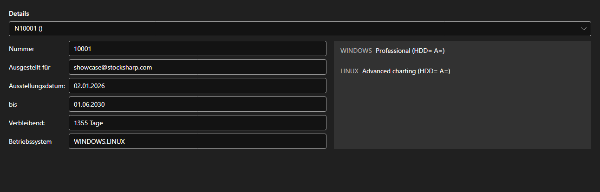

# Lizenzen



[LicensePanel](xref:StockSharp.Xaml.LicensePanel) - ein Panel der installierten Lizenzen. Die Lizenz wird in der Liste oben gewählt; darunter stehen ihre Nummer, der Inhaber, Ausstellungs\- und Ablaufdatum, die verbleibenden Tage und die unterstützten Betriebssysteme, rechts die freigeschalteten Funktionen.

**Haupteigenschaften**

- [LicensePanel.Licenses](xref:StockSharp.Xaml.LicensePanel.Licenses) - Liste der Lizenzen.

Das Panel wird in das Info-Fenster und in den Assistenten für den ersten Start eingebettet: Man sieht sofort, welche Lizenz ausläuft und welche Funktionen fehlen.

Nachfolgend Codeausschnitte zur Verwendung:

```xaml
<Window x:Class="Sample.LicenseWindow"
	xmlns="http://schemas.microsoft.com/winfx/2006/xaml/presentation"
	xmlns:x="http://schemas.microsoft.com/winfx/2006/xaml"
	xmlns:xaml="http://schemas.stocksharp.com/xaml"
	Height="400" Width="800">
	<xaml:LicensePanel x:Name="LicensePanel" />
</Window>
```

```cs
// Installierte Lizenzen anzeigen
LicensePanel.Licenses = LicenseHelper.Licenses;
```

## Siehe auch

[Dienstpanels](../service_panels.md)
