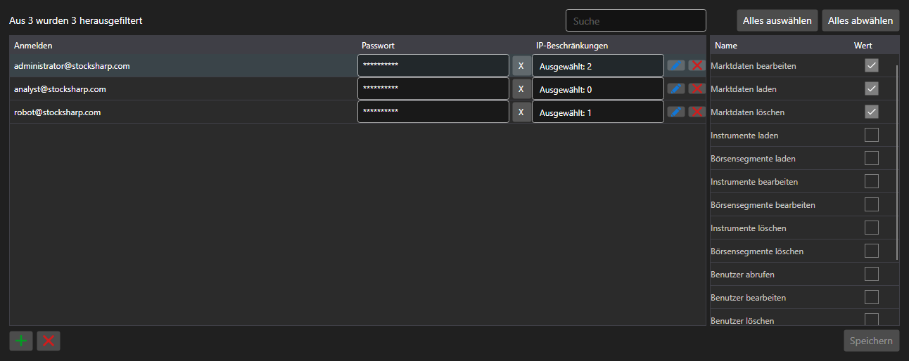

# Konten und Rechte



[PermissionCredentialsPanel](xref:StockSharp.Xaml.PermissionCredentialsPanel) - eine Tabelle der Serverkonten mit Zugriffsrechten. Für jeden Eintrag wird vermerkt, welche Vorgänge erlaubt sind: Daten laden, bearbeiten, Orders erfassen, den Server verwalten.

**Haupteigenschaften**

- [PermissionCredentialsPanel.Credentials](xref:StockSharp.Xaml.PermissionCredentialsPanel.Credentials) - Liste der Konten.
- [PermissionCredentialsPanel.ChangedCredentials](xref:StockSharp.Xaml.PermissionCredentialsPanel.ChangedCredentials) - seit dem letzten Speichern geänderte Einträge.
- [PermissionCredentialsPanel.SaveText](xref:StockSharp.Xaml.PermissionCredentialsPanel.SaveText) - Beschriftung der Schaltfläche zum Speichern.

Die Einträge speichert das Panel nicht selbst \- über die Schaltfläche löst es das Ereignis `Saving` aus, die Anwendung schreibt die geänderten Konten und ruft [PermissionCredentialsPanel.MarkSaved](xref:StockSharp.Xaml.PermissionCredentialsPanel.MarkSaved) auf, woraufhin die Liste der Änderungen geleert wird.

Nachfolgend Codeausschnitte zur Verwendung:

```xaml
<Window x:Class="Sample.CredentialsWindow"
	xmlns="http://schemas.microsoft.com/winfx/2006/xaml/presentation"
	xmlns:x="http://schemas.microsoft.com/winfx/2006/xaml"
	xmlns:xaml="http://schemas.stocksharp.com/xaml"
	Height="500" Width="900">
	<xaml:PermissionCredentialsPanel x:Name="CredentialsPanel" />
</Window>
```

```cs
// Serverkonten anzeigen
CredentialsPanel.Credentials.AddRange(_server.Credentials);

// Nur die geänderten Einträge speichern
CredentialsPanel.Saving += () =>
{
	foreach (var credentials in CredentialsPanel.ChangedCredentials)
		_server.Save(credentials);

	// Liste der Änderungen zurücksetzen
	CredentialsPanel.MarkSaved();
};
```

## Siehe auch

[Dienstpanels](../service_panels.md)
