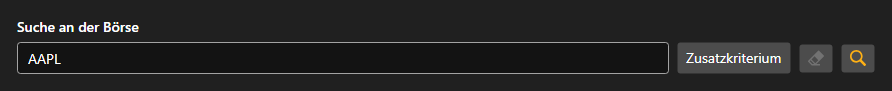

# Instrumentensuche



[SecurityLookupPanel](xref:StockSharp.Xaml.SecurityLookupPanel) - ein Panel für die Instrumentensuche. In das Suchfeld wird der Code oder ein Teil davon eingegeben; hinter der Schaltfläche für den zusätzlichen Filter öffnet sich ein [Security](xref:StockSharp.BusinessEntities.Security)\-Editor, in dem Typ, Börsenplatz, Währung und Verfallsdatum festgelegt werden.

Das Panel sucht selbst nichts \- über die Suchschaltfläche oder die Eingabetaste löst es das Ereignis `Lookup` mit dem ausgefüllten Filter aus. Was danach geschieht \- Anfrage an den Connector oder Suche im lokalen Speicher \- entscheidet die Anwendung.

Nachfolgend Codeausschnitte zur Verwendung:

```xaml
<Window x:Class="Sample.LookupWindow"
	xmlns="http://schemas.microsoft.com/winfx/2006/xaml/presentation"
	xmlns:x="http://schemas.microsoft.com/winfx/2006/xaml"
	xmlns:xaml="http://schemas.stocksharp.com/xaml"
	Height="500" Width="400">
	<xaml:SecurityLookupPanel x:Name="LookupPanel" />
</Window>
```

```cs
// Suchanfrage an den Connector senden
LookupPanel.Lookup += filter =>
{
	// Der Filter kommt ausgefüllt an
	_connector.Subscribe(new Subscription(filter.ToLookupMessage()));
};

// Gefundene Instrumente in der Tabelle anzeigen
_connector.SecurityReceived += (subscription, security) =>
	this.GuiAsync(() => SecurityGrid.Securities.Add(security));
```

## Siehe auch

[Dienstpanels](../service_panels.md)
