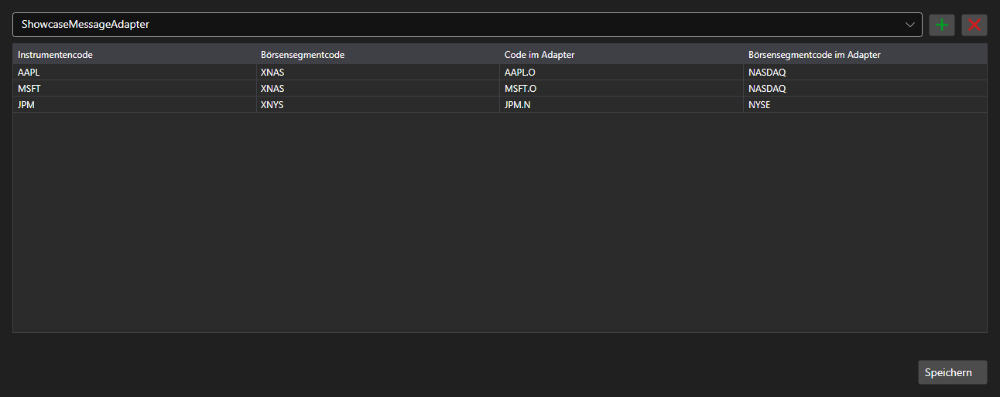

# Zuordnung von Instrumentencodes



[SecurityMappingPanel](xref:StockSharp.Xaml.SecurityMappingPanel) - eine Tabelle der Zuordnungen zwischen dem Instrumentencode im System und dem Code bei einem bestimmten Connector. Sie löst das übliche Problem, dass derselbe Kontrakt bei verschiedenen Datenanbietern unterschiedlich heißt.

**Haupteigenschaften**

- [SecurityMappingPanel.ConnectorsInfo](xref:StockSharp.Xaml.SecurityMappingPanel.ConnectorsInfo) - Liste der Connectoren, für die Zuordnungen festgelegt werden.
- [SecurityMappingPanel.Storage](xref:StockSharp.Xaml.SecurityMappingPanel.Storage) - Speicher der Zuordnungen.
- [SecurityMappingPanel.SaveText](xref:StockSharp.Xaml.SecurityMappingPanel.SaveText) - Beschriftung der Schaltfläche zum Speichern.

Zeilen werden direkt in der Tabelle hinzugefügt und entfernt; ein Klick auf die Schaltfläche löst das Ereignis `Saving` aus \- die Anwendung schreibt die Änderungen in den Speicher und ändert die Beschriftung.

Nachfolgend Codeausschnitte zur Verwendung:

```xaml
<Window x:Class="Sample.MappingWindow"
	xmlns="http://schemas.microsoft.com/winfx/2006/xaml/presentation"
	xmlns:x="http://schemas.microsoft.com/winfx/2006/xaml"
	xmlns:xaml="http://schemas.stocksharp.com/xaml"
	Height="500" Width="900">
	<xaml:SecurityMappingPanel x:Name="MappingPanel" />
</Window>
```

```cs
// Speicher der Zuordnungen setzen
MappingPanel.Storage = _securityMappingStorage;

// Connector zur Liste hinzufügen
MappingPanel.ConnectorsInfo.Add(new ConnectorInfo("Binance"));

// Speichern über die Beschriftung bestätigen
MappingPanel.Saving += () => MappingPanel.SaveText = LocalizedStrings.Saved;
```

## Siehe auch

[Dienstpanels](../service_panels.md)
