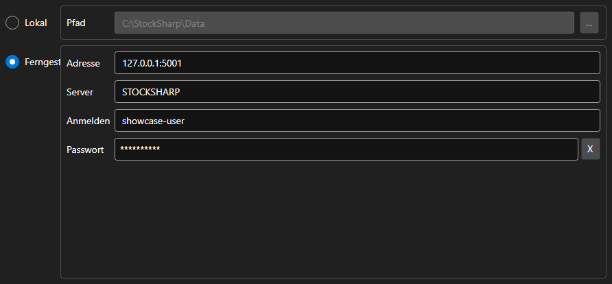

# Speichereinstellungen



[StorageSettingsPanel](xref:StockSharp.Xaml.StorageSettingsPanel) - ein Panel zur Auswahl des Marktdatenspeichers. Es wechselt zwischen einem lokalen Ordner und einem entfernten Server und setzt die Parameter der gewählten Variante.

**Haupteigenschaften**

- [StorageSettingsPanel.IsLocal](xref:StockSharp.Xaml.StorageSettingsPanel.IsLocal) - lokalen Speicher verwenden.
- [StorageSettingsPanel.Path](xref:StockSharp.Xaml.StorageSettingsPanel.Path) - Pfad zum Ordner des lokalen Speichers.
- [StorageSettingsPanel.Address](xref:StockSharp.Xaml.StorageSettingsPanel.Address) - Adresse des entfernten Servers.
- [StorageSettingsPanel.Login](xref:StockSharp.Xaml.StorageSettingsPanel.Login) - Benutzername für den entfernten Server.
- [StorageSettingsPanel.IsCredentialsEnabled](xref:StockSharp.Xaml.StorageSettingsPanel.IsCredentialsEnabled) - Verfügbarkeit der Felder für Anmeldename und Kennwort.

Jede Änderung löst das Ereignis `SettingsChanged` aus, woraufhin die Anwendung den [IMarketDataDrive](xref:StockSharp.Algo.Storages.IMarketDataDrive) neu erzeugt.

Nachfolgend Codeausschnitte zur Verwendung:

```xaml
<Window x:Class="Sample.StorageWindow"
	xmlns="http://schemas.microsoft.com/winfx/2006/xaml/presentation"
	xmlns:x="http://schemas.microsoft.com/winfx/2006/xaml"
	xmlns:xaml="http://schemas.stocksharp.com/xaml"
	Height="300" Width="500">
	<xaml:StorageSettingsPanel x:Name="StoragePanel" />
</Window>
```

```cs
// Lokalen Ordner wählen
StoragePanel.IsLocal = true;
StoragePanel.Path = @"C:\Data";

// Änderung der Einstellungen vermerken
StoragePanel.SettingsChanged += () => _isModified = true;

// Speicher anhand der Paneleinstellungen erzeugen
var drive = StoragePanel.IsLocal
	? new LocalMarketDataDrive(StoragePanel.Path)
	: (IMarketDataDrive)new RemoteMarketDataDrive(StoragePanel.Address.To<EndPoint>());
```

## Siehe auch

[Dienstpanels](../service_panels.md)
