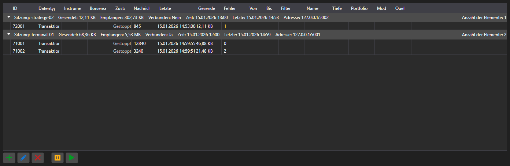

# Abonnements



[SubscriptionPanel](xref:StockSharp.Xaml.SubscriptionPanel) - eine Tabelle der aktiven Abonnements, gruppiert nach Sitzungen. Für jedes Abonnement zeigt sie die Datenart, die Anzahl der Meldungen, die Zeit der letzten Meldung, die Fehleranzahl und die übertragene Datenmenge.

**Haupteigenschaften**

- [SubscriptionPanel.Subscriptions](xref:StockSharp.Xaml.SubscriptionPanel.Subscriptions) - Liste der Abonnements.
- [SubscriptionPanel.Sessions](xref:StockSharp.Xaml.SubscriptionPanel.Sessions) - Liste der Sitzungen.
- [SubscriptionPanel.SelectedSubscriptions](xref:StockSharp.Xaml.SubscriptionPanel.SelectedSubscriptions) - ausgewählte Abonnements.

Das Panel wird auf der Serverseite eingesetzt: Man sieht, wer verbunden ist, was angefordert wird und wie viele Daten fließen. Aktionen an den Zeilen \- Hinzufügen, Ändern, Entfernen, Pausieren \- lösen die gleichnamigen Ereignisse aus, ausgeführt werden sie von der Anwendung.

Nachfolgend Codeausschnitte zur Verwendung:

```xaml
<Window x:Class="Sample.SubscriptionsWindow"
	xmlns="http://schemas.microsoft.com/winfx/2006/xaml/presentation"
	xmlns:x="http://schemas.microsoft.com/winfx/2006/xaml"
	xmlns:xaml="http://schemas.stocksharp.com/xaml"
	Height="400" Width="1000">
	<xaml:SubscriptionPanel x:Name="SubscriptionPanel" />
</Window>
```

```cs
// Sitzung des Clients registrieren
SubscriptionPanel.AddSession(sessionId, new SessionInfo(sessionId, DateTime.UtcNow, address));

// Abonnement in die Tabelle eintragen
SubscriptionPanel.Subscriptions.Add(new SubscriptionInfo(session, subscription));

// Auf Befehl aus der Tabelle abmelden
SubscriptionPanel.SubscriptionRemoving += info => _connector.UnSubscribe(info.Subscription);
```

## Siehe auch

[Dienstpanels](../service_panels.md)
