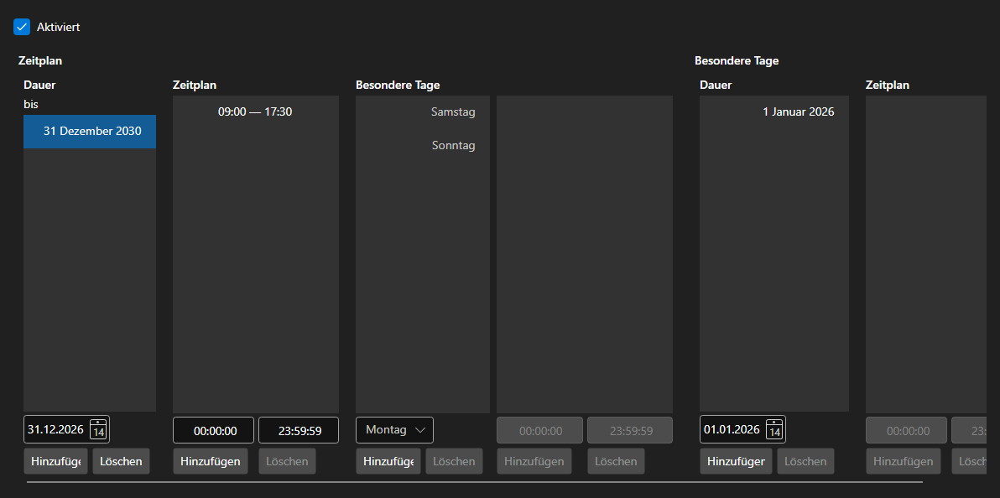

# Zeitplan



[WorkingTimeControl](xref:StockSharp.Xaml.WorkingTimeControl) - ein Editor für den Zeitplan [WorkingTime](xref:StockSharp.Messages.WorkingTime). Er legt die Gültigkeitszeiträume, die Arbeitszeiten je Wochentag und besondere Tage \- Feiertage und Verlegungen \- fest.

**Haupteigenschaften**

- [WorkingTimeControl.WorkingTime](xref:StockSharp.Xaml.WorkingTimeControl.WorkingTime) - bearbeiteter Zeitplan.
- [WorkingTimeControl.ShowActive](xref:StockSharp.Xaml.WorkingTimeControl.ShowActive) - Anzeige des gerade gültigen Zeitraums.

Ein Zeitplan besteht aus Zeiträumen mit jeweils eigenen Arbeitszeiten je Wochentag. Die Zeiten werden als Liste von Intervallen bearbeitet; Fehler \- überlappende Intervalle, ein Ende vor dem Beginn \- meldet das Ereignis `Error`.

Nachfolgend Codeausschnitte zur Verwendung:

```xaml
<Window x:Class="Sample.WorkingTimeWindow"
	xmlns="http://schemas.microsoft.com/winfx/2006/xaml/presentation"
	xmlns:x="http://schemas.microsoft.com/winfx/2006/xaml"
	xmlns:xaml="http://schemas.stocksharp.com/xaml"
	Height="500" Width="700">
	<xaml:WorkingTimeControl x:Name="WorkingTimeControl" />
</Window>
```

```cs
// Zeitplan des Platzes anzeigen
WorkingTimeControl.WorkingTime = ExchangeBoard.MicexTqbr.WorkingTime;

// Fehler neben dem Editor ausgeben
WorkingTimeControl.Error += (message, isError) => ShowStatus(message, isError);

// Änderung des Zeitplans vermerken
WorkingTimeControl.DataChanged += () => _isModified = true;
```

## Siehe auch

[Dienstpanels](../service_panels.md)
