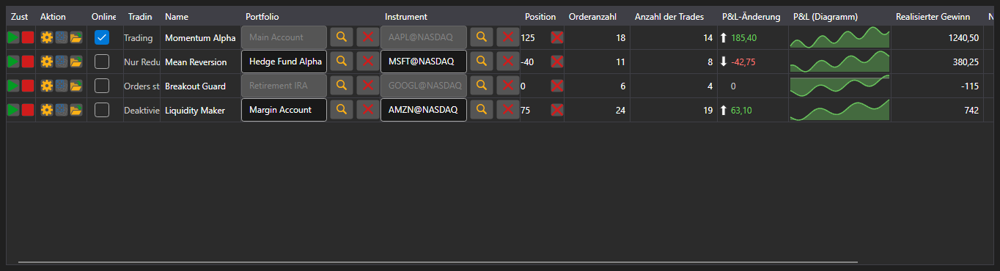

# Strategie-Monitor



[StrategiesDashboard](xref:StockSharp.Xaml.StrategiesDashboard) - eine Tabelle gleichzeitig laufender Strategien. Eine Zeile zeigt Instrument, Portfolio, Zustand, Position, Gewinn, Anzahl Orders und Trades sowie die Steuerschaltflächen.

**Haupteigenschaften**

- [StrategiesDashboard.Items](xref:StockSharp.Xaml.StrategiesDashboard.Items) - Liste der Monitorzeilen.
- [StrategiesDashboard.SecurityProvider](xref:StockSharp.Xaml.StrategiesDashboard.SecurityProvider) - Instrumentenanbieter für die Instrumentenspalte.
- [StrategiesDashboard.Portfolios](xref:StockSharp.Xaml.StrategiesDashboard.Portfolios) - Portfolioquelle für die Portfoliospalte.

Eine Monitorzeile ist ein [IStrategiesDashboardItem](xref:StockSharp.Xaml.IStrategiesDashboardItem) und nicht die Strategie selbst: Die Schaltflächen für Start, Stopp, Position schließen, Einstellungen und Risikoregeln arbeiten über die Befehle dieser Schnittstelle. Deshalb eignet sich der Monitor sowohl für lokale als auch für serverseitig laufende Strategien.

Nachfolgend Codeausschnitte zur Verwendung:

```xaml
<Window x:Class="Sample.DashboardWindow"
	xmlns="http://schemas.microsoft.com/winfx/2006/xaml/presentation"
	xmlns:x="http://schemas.microsoft.com/winfx/2006/xaml"
	xmlns:xaml="http://schemas.stocksharp.com/xaml"
	Height="400" Width="1100">
	<xaml:StrategiesDashboard x:Name="Dashboard" />
</Window>
```

```cs
// Quellen für Instrumenten- und Portfoliospalte setzen
Dashboard.SecurityProvider = _connector;
Dashboard.Portfolios = new PortfolioDataSource(_connector);

// Monitorzeilen für die eigenen Strategien hinzufügen
foreach (var strategy in _strategies)
	Dashboard.Items.Add(new StrategyDashboardItem(strategy));

// Gestoppte Strategie aus dem Monitor entfernen
Dashboard.Items.Remove(Dashboard.Items.First(i => i.ProcessState == ProcessStates.Stopped));
```

## Siehe auch

[Strategien](../strategies.md)
