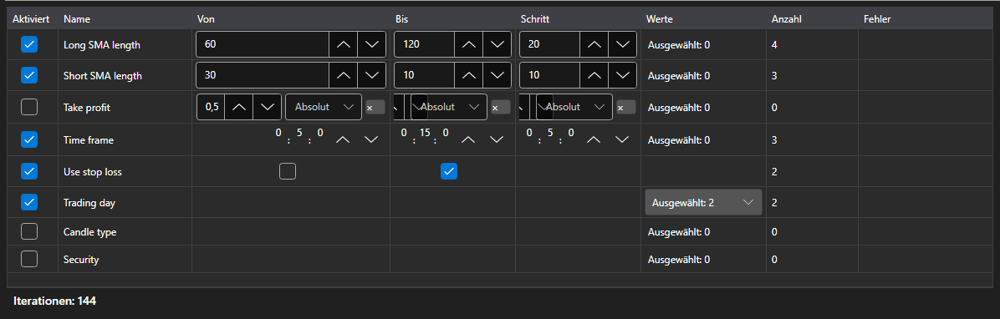

# Optimierungsparameter



[OptimizationParametersPanel](xref:StockSharp.Xaml.OptimizationParametersPanel) \- ein Editor für die Parameter, die durchlaufen werden. Eine Zeile \- ein Strategieparameter: Das Kontrollkästchen nimmt ihn in den Durchlauf auf, danach folgen Grenzen und Schritt oder eine Werteliste, und unter der Tabelle steht das Ergebnis: wie viele Läufe der aktuelle Satz ergibt.

**Haupteigenschaften**

- [OptimizationParametersPanel.Parameters](xref:StockSharp.Xaml.OptimizationParametersPanel.Parameters) \- die Zeilen des Editors. Geeignet ist jede Sammlung von [IOptimizationParameterRow](xref:StockSharp.Xaml.IOptimizationParameterRow), deshalb kann jede Anwendung ihr eigenes Parametermodell mitbringen.
- [OptimizationParametersPanel.MaxIterations](xref:StockSharp.Xaml.OptimizationParametersPanel.MaxIterations) \- die Obergrenze für die Anzahl der Läufe; null bedeutet, dass es keine Grenze gibt.
- [OptimizationParametersPanel.TotalCount](xref:StockSharp.Xaml.OptimizationParametersPanel.TotalCount) \- wie viele Läufe der aktuelle Satz ergibt: das Produkt aus der Anzahl der Werte aller eingeschalteten Parameter, gekappt durch die Obergrenze.
- [OptimizationParametersPanel.FirstProblem](xref:StockSharp.Xaml.OptimizationParametersPanel.FirstProblem) \- der erste Grund, aus dem sich der Satz nicht starten lässt.

Welche Werte durchlaufen werden, hängt vom Typ des Parameters ab: bei einer Zahl und bei [TimeSpan](xref:System.TimeSpan) sind es Grenzen und Schritt, bei [bool](xref:System.Boolean) zwei Werte, bei einer Aufzählung, bei [Security](xref:StockSharp.BusinessEntities.Security) und bei [DataType](xref:StockSharp.Messages.DataType) eine ausdrückliche Liste. Eine Zeile, die sich nicht durchlaufen lässt (Schritt gleich null, Grenzen nicht gesetzt, Liste leer), nennt den Grund unmittelbar in der Tabelle, und der Gesamtzähler zählt eine solche Zeile nicht mit.

Die Anzahl der Läufe wächst als Produkt und nicht als Summe: drei Parameter mit je fünf Werten ergeben 125 Läufe und nicht 15. Deshalb steht der Zähler neben der Tabelle und nicht erst im nächsten Schritt des Assistenten.

Nachfolgend Codeausschnitte zur Verwendung:

```xaml
<Window x:Class="Sample.OptimizationWindow"
	xmlns="http://schemas.microsoft.com/winfx/2006/xaml/presentation"
	xmlns:x="http://schemas.microsoft.com/winfx/2006/xaml"
	xmlns:xaml="http://schemas.stocksharp.com/xaml"
	Height="400" Width="700">
	<xaml:OptimizationParametersPanel x:Name="ParametersPanel" />
</Window>
```

```cs
// Die Zeilen des Editors sind das Modell der Anwendung, das IOptimizationParameterRow implementiert
ParametersPanel.Parameters = _rows;

// Obergrenze für die Anzahl der Läufe
ParametersPanel.MaxIterations = 5000;

// Starten ist möglich, wenn der Satz nicht leer ist und keine Fehler enthält
StartButton.IsEnabled = ParametersPanel.TotalCount > 0 && ParametersPanel.FirstProblem.Length == 0;
```

## Siehe auch

[Strategien](../strategies.md)

[Optimierungsergebnisse](optimization_results.md)
