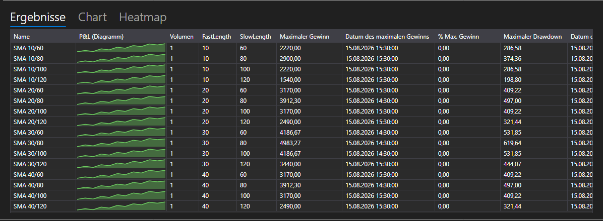

# Optimierungsergebnisse



[OptimizationResultsPanel](xref:StockSharp.Xaml.Charting.OptimizationResultsPanel) \- drei Arten, die Ergebnisse eines Durchlaufs zu lesen, in einem Steuerelement vereint:

- **Ergebnisse** \- eine Tabelle der Läufe: Parameterwerte, Statistik und die P/L-Kurve jedes Laufs neben seinen Zahlen. Das ist [StrategiesStatisticsPanel](xref:StockSharp.Xaml.StrategiesStatisticsPanel), deshalb lassen sich die Spalten wie überall sortieren und einstellen.
- **Diagramm** \- eine dreidimensionale Fläche über zwei Parameter: Die Achsen werden in den Listen über dem Diagramm gewählt, die Höhe ist die ausgewählte statistische Kennzahl.
- **Heatmap** \- dieselbe Fläche von oben. Die Achsen werden einmal im Diagramm festgelegt, die Karte übernimmt sie.

**Haupteigenschaften**

- [OptimizationResultsPanel.ViewModel](xref:StockSharp.Xaml.Charting.OptimizationResultsPanel.ViewModel) \- die Ergebnisse, aus denen alle drei Flächen gezeichnet werden.

Läufe werden dem [OptimizationResultsViewModel](xref:StockSharp.Xaml.Charting.OptimizationResultsViewModel) im Moment des Starts hinzugefügt und nicht erst nach dem Ende: Die Zeile erscheint sofort in der Tabelle und verfolgt danach ihre Strategie, deshalb ist ein laufender Durchgang auf allen drei Flächen sichtbar.

- [OptimizationResultsViewModel.AddRun](xref:StockSharp.Xaml.Charting.OptimizationResultsViewModel.AddRun(StockSharp.Algo.Strategies.Strategy,System.Collections.Generic.IEnumerable{StockSharp.Algo.Strategies.IStrategyParam})) \- fügt einen Lauf hinzu. Der erste Lauf legt die Spalten der Tabelle fest und das, was die Achsen zur Auswahl anbieten.
- [OptimizationResultsViewModel.Refresh](xref:StockSharp.Xaml.Charting.OptimizationResultsViewModel.Refresh) \- zeichnet die Flächen neu, wenn sich die gemessenen Werte geändert haben.
- [OptimizationResultsViewModel.Clear](xref:StockSharp.Xaml.Charting.OptimizationResultsViewModel.Clear) \- setzt die Läufe vor einem neuen Durchlauf zurück.

Eine Parameterkombination \- ein Punkt der Fläche. Wurde eine Kombination mehrfach durchlaufen, zeigt der Punkt den Mittelwert; wurde sie überhaupt nicht durchlaufen, füllt die Heatmap sie mit dem kleinsten Wert, damit die Lücke nicht wie ein Gipfel aussieht.

Nachfolgend Codeausschnitte zur Verwendung:

```xaml
<Window x:Class="Sample.OptimizationResultsWindow"
	xmlns="http://schemas.microsoft.com/winfx/2006/xaml/presentation"
	xmlns:x="http://schemas.microsoft.com/winfx/2006/xaml"
	xmlns:charting="http://schemas.stocksharp.com/xaml"
	Height="600" Width="900">
	<charting:OptimizationResultsPanel x:Name="ResultsPanel" />
</Window>
```

```cs
_results = new OptimizationResultsViewModel();
ResultsPanel.ViewModel = _results;

// Der Optimierer meldet einen Lauf im Moment seines Starts
_optimizer.StrategyInitialized += (strategy, parameters) =>
	this.GuiAsync(() => _results.AddRun(strategy, parameters));
```

## Siehe auch

[Strategien](../strategies.md)

[Optimierungsparameter](optimization_parameters.md)
