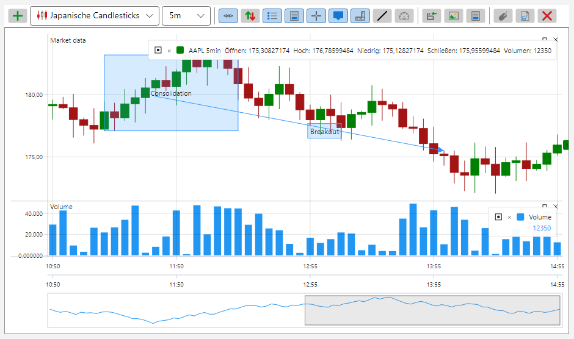

# Themes der grafischen S#-Komponenten

Alle grafischen S#-Komponenten sind in zwei Themes gestaltet \- einem hellen und einem dunklen. Das Theme wird einmal auf Ebene der Anwendung festgelegt, und alle Komponenten übernehmen es sofort: Die Farben stammen aus Ressourcen und werden nicht in jedem Steuerelement einzeln eingetragen.

Helles Theme:



Dunkles Theme:


Zum Festlegen des Themes genügt eine Zeile:

```cs
...
ThemeExtensions.ApplyDefaultTheme();
...
```

**Wichtigste Methoden von [ThemeExtensions](xref:StockSharp.Xaml.ThemeExtensions)**

- [ThemeExtensions.ApplyDefaultTheme](xref:StockSharp.Xaml.ThemeExtensions.ApplyDefaultTheme(System.Boolean)) \- wendet das dunkle oder das helle Theme an.
- [ThemeExtensions.Invert](xref:StockSharp.Xaml.ThemeExtensions.Invert) \- schaltet auf das jeweils entgegengesetzte Theme um.
- [ThemeExtensions.IsCurrDark](xref:StockSharp.Xaml.ThemeExtensions.IsCurrDark) \- gibt an, ob das aktuelle Theme dunkel ist.

Ein Wechsel des Themes wirkt sofort: Ein Neustart der Anwendung ist nicht nötig, alle geöffneten Panels und Diagramme werden in den neuen Farben neu gezeichnet.

Farben, die für die Handelskomponenten typisch sind \- Anstieg und Rückgang, Kauf und Verkauf, Ebenen des Orderbuchs, Raster der Tabellen \- liegen in einem eigenen Satz von Ressourcen und ändern sich zusammen mit dem Theme. Deshalb wirkt ein eigenes Steuerelement, das seine Farben aus diesem Satz bezieht und sie nicht selbst festlegt, in beiden Themes gleichermaßen stimmig.
