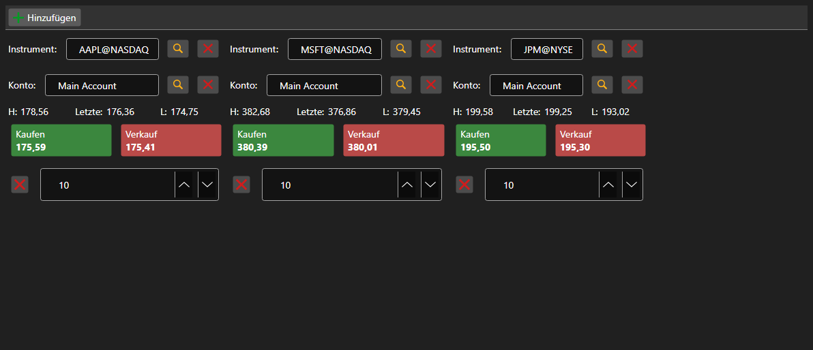

# Satz von Kaufen\/Verkaufen\-Panels



[BuySellGrid](xref:StockSharp.Xaml.BuySellGrid) - ein Container mit mehreren [BuySellPanel](xref:StockSharp.Xaml.BuySellPanel)\-Panels \- eines je Instrument. Damit lassen sich mehrere Instrumente von einem Bildschirm aus handeln.

**Haupteigenschaften**

- [BuySellGrid.SecurityProvider](xref:StockSharp.Xaml.BuySellGrid.SecurityProvider) - Instrumentenanbieter für die Auswahl in den Panels.
- [BuySellGrid.Portfolios](xref:StockSharp.Xaml.BuySellGrid.Portfolios) - Portfolioquelle.
- [BuySellGrid.MarketDataProvider](xref:StockSharp.Xaml.BuySellGrid.MarketDataProvider) - Marktdatenanbieter, von dem die Panels die besten Preise beziehen.
- [BuySellGrid.Panels](xref:StockSharp.Xaml.BuySellGrid.Panels) - aktueller Satz der Panels.

Panels werden mit [BuySellGrid.AddPanel](xref:StockSharp.Xaml.BuySellGrid.AddPanel(StockSharp.BusinessEntities.Security)) hinzugefügt und mit [BuySellGrid.RemovePanel](xref:StockSharp.Xaml.BuySellGrid.RemovePanel(StockSharp.Xaml.BuySellPanel)) entfernt. Der Container registriert keine Orders \- er löst `OrderRegistering` mit Instrument, Portfolio, Richtung, Preis und Volumen aus. Die Zusammenstellung der Panels wird mit `Save` und `Load` gespeichert und wiederhergestellt.

Nachfolgend Codeausschnitte zur Verwendung:

```xaml
<Window x:Class="Sample.BuySellWindow"
	xmlns="http://schemas.microsoft.com/winfx/2006/xaml/presentation"
	xmlns:x="http://schemas.microsoft.com/winfx/2006/xaml"
	xmlns:xaml="http://schemas.stocksharp.com/xaml"
	Height="400" Width="900">
	<xaml:BuySellGrid x:Name="BuySellGrid" />
</Window>
```

```cs
// Datenquellen für alle Panels setzen
BuySellGrid.SecurityProvider = _connector;
BuySellGrid.MarketDataProvider = _connector;
BuySellGrid.Portfolios = new PortfolioDataSource(_connector);

// Panel für das Instrument hinzufügen
BuySellGrid.AddPanel(_security);

// Die vom Panel erzeugte Order registrieren
BuySellGrid.OrderRegistering += (security, portfolio, side, price, volume) =>
{
	_connector.RegisterOrder(new Order
	{
		Security = security,
		Portfolio = portfolio,
		Side = side,
		Price = price,
		Volume = volume,
	});
};
```

## Siehe auch

[Handel](../trading.md)
