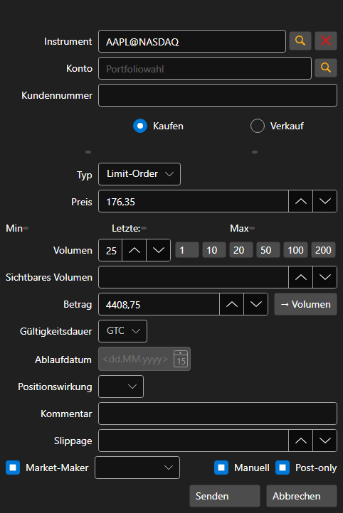

# Erstellen eines neuen Auftrags

[OrderWindow](xref:StockSharp.Xaml.OrderWindow) - Fenster zum Erstellen eines Auftrags.



Wenn die Verbindung das Registrieren eines bedingten Auftrags (Stop-Loss, Take-Profit) unterstützt, können Sie in diesem Fenster einen bedingten Auftrag mit erweiterten Bedingungen registrieren, indem Sie das Flag **Erweiterte Bedingungen** setzen.

**Grundlegende Eigenschaften**

- [OrderWindow.Portfolios](xref:StockSharp.Xaml.OrderWindow.Portfolios) - Liste der Portfolios.
- [OrderWindow.MarketDataProvider](xref:StockSharp.Xaml.OrderWindow.MarketDataProvider) - Marktdatenprovider.
- [OrderWindow.SecurityProvider](xref:StockSharp.Xaml.OrderWindow.SecurityProvider) - Provider für Instrumenteninformationen.
- [OrderWindow.Order](xref:StockSharp.Xaml.OrderWindow.Order) - erstellter Auftrag.

Codebeispiele für die Verwendung sind unten gezeigt. Beispielcode aus *Samples\/01\_Basic\/03\_Orders*.

```cs
...
private readonly Connector _connector = new Connector();
...
private void NewOrderClick(object sender, RoutedEventArgs e)
{
	var wnd = new OrderWindow
	{
		Order = new Order { Security = SecurityPicker.SelectedSecurity },
		SecurityProvider = _connector,
		MarketDataProvider = _connector,
		Portfolios = new PortfolioDataSource(_connector),
	};
	if (wnd.ShowModal(this))
		_connector.RegisterOrder(wnd.Order);
}


```
