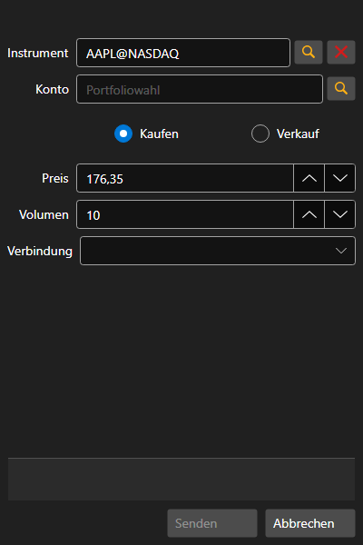

# Erstellen einer neuen Stop-Order

[OrderConditionalWindow](xref:StockSharp.Xaml.OrderConditionalWindow) - das Fenster zum Erstellen einer bedingten Order.



**Wichtigste Eigenschaften**

- [OrderConditionalWindow.Portfolios](xref:StockSharp.Xaml.OrderConditionalWindow.Portfolios) - Liste der Portfolios.
- [OrderConditionalWindow.SecurityProvider](xref:StockSharp.Xaml.OrderConditionalWindow.SecurityProvider) - Provider für Informationen über Instrumente.
- [OrderConditionalWindow.MarketDataProvider](xref:StockSharp.Xaml.OrderConditionalWindow.MarketDataProvider) - Provider für Marktdaten.
- [OrderConditionalWindow.Adapter](xref:StockSharp.Xaml.OrderConditionalWindow.Adapter) - Nachrichtenadapter.
- [OrderConditionalWindow.Order](xref:StockSharp.Xaml.OrderConditionalWindow.Order) - die erstellte Order.

Unten ist ein Codebeispiel für die Verwendung. Das Codebeispiel stammt aus *Samples\/InteractiveBrokers\/SampleIB*.

```cs
...
private readonly Connector _connector = new Connector();
...
private void NewStopOrderClick(object sender, RoutedEventArgs e)
{
	var wnd = new OrderConditionalWindow
	{
		Order = new Order
		{
			Security = SecurityPicker.SelectedSecurity,
			Type = OrderTypes.Conditional,
			ExpiryDate = DateTime.Today
		},
		SecurityProvider = _connector,
		MarketDataProvider = _connector,
		Portfolios = new PortfolioDataSource(_connector),
		Adapter = _connector.Adapter
	};
	if (wnd.ShowModal(this))
		_connector.RegisterOrder(wnd.Order);
}


```
