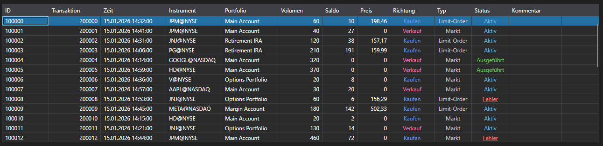

# Orders

[OrderGrid](xref:StockSharp.Xaml.OrderGrid) ist eine Tabelle zur Anzeige von Orders und bedingten Orders. Außerdem enthält das Kontextmenü dieser Tabelle Befehle für Operationen mit Orders: Registrierung, Änderung und Stornierung von Orders. Die Auswahl eines Menüeintrags erzeugt die Ereignisse [OrderGrid.OrderRegistering](xref:StockSharp.Xaml.OrderGrid.OrderRegistering), [OrderGrid.OrderReRegistering](xref:StockSharp.Xaml.OrderGrid.OrderReRegistering) bzw. [OrderGrid.OrderCanceling](xref:StockSharp.Xaml.OrderGrid.OrderCanceling).



> [!TIP]
> Die Operation selbst (Registrierung, Änderung, Stornierung) wird nicht ausgeführt. Der entsprechende Code muss manuell in den Ereignishandlern geschrieben werden.

**Wichtigste Member**

- [OrderGrid.Orders](xref:StockSharp.Xaml.OrderGrid.Orders) - Liste der Orders.
- [OrderGrid.SelectedOrder](xref:StockSharp.Xaml.OrderGrid.SelectedOrder) - ausgewählte Order.
- [OrderGrid.SelectedOrders](xref:StockSharp.Xaml.OrderGrid.SelectedOrders) - ausgewählte Orders.
- [OrderGrid.AddRegistrationFail](xref:StockSharp.Xaml.OrderGrid.AddRegistrationFail(StockSharp.BusinessEntities.OrderFail))**(**[StockSharp.BusinessEntities.OrderFail](xref:StockSharp.BusinessEntities.OrderFail) fail **)** - Methode, die eine Fehlermeldung zur Orderregistrierung zum Kommentarfeld hinzufügt.
- [OrderGrid.OrderRegistering](xref:StockSharp.Xaml.OrderGrid.OrderRegistering) - Ereignis zur Orderregistrierung (tritt nach Auswahl des entsprechenden Kontextmenüeintrags auf).
- [OrderGrid.OrderReRegistering](xref:StockSharp.Xaml.OrderGrid.OrderReRegistering) - Ereignis zur Orderänderung (tritt nach Auswahl des entsprechenden Kontextmenüeintrags auf).
- [OrderGrid.OrderCanceling](xref:StockSharp.Xaml.OrderGrid.OrderCanceling) - Ereignis zur Orderstornierung (tritt nach Auswahl des entsprechenden Kontextmenüeintrags auf).

Unten sind Codefragmente für die Verwendung gezeigt. Das Codebeispiel stammt aus *Samples\/01\_Basic\/03\_Orders*.

```xaml
<Window x:Class="Sample.OrdersWindow"
	xmlns="http://schemas.microsoft.com/winfx/2006/xaml/presentation"
	xmlns:x="http://schemas.microsoft.com/winfx/2006/xaml"
	xmlns:loc="clr-namespace:StockSharp.Localization;assembly=StockSharp.Localization"
	xmlns:xaml="http://schemas.stocksharp.com/xaml"
	Title="{x:Static loc:LocalizedStrings.Orders}" Height="410" Width="930">
	<xaml:OrderGrid x:Name="OrderGrid" x:FieldModifier="public"
					OrderCanceling="OrderGrid_OnOrderCanceling"
					OrderReRegistering="OrderGrid_OnOrderReRegistering" />
</Window>

```
```cs
private readonly Connector _connector = new Connector();

private void ConnectClick(object sender, RoutedEventArgs e)
{
	// Sonstiger Code während der Verbindung...

	// Ereignis für empfangene Orders abonnieren
	_connector.OrderReceived += (subscription, order) =>
	{
		// Orders zur Tabelle OrderGrid hinzufügen
		_ordersWindow.OrderGrid.Orders.TryAdd(order);
	};

	// Connector verbinden
	_connector.Connect();
}

// Storniert alle ausgewählten Orders
private void OrderGrid_OnOrderCanceling(IEnumerable<Order> orders)
{
	// Durch ausgewählte Orders iterieren und jede stornieren
	foreach (var order in orders)
	{
		_connector.CancelOrder(order);
	}
}

// Öffnet ein Fenster zum Bearbeiten der Order und führt die Änderung der ausgewählten Order aus
private void OrderGrid_OnOrderReRegistering(Order order)
{
	var window = new OrderWindow
	{
		Title = LocalizedStrings.Str2976Params.Put(order.TransactionId),
		SecurityProvider = _connector,
		MarketDataProvider = _connector,
		Portfolios = new PortfolioDataSource(_connector),
		Order = order.ReRegisterClone(newVolume: order.Balance)
	};

	if (window.ShowModal(this))
		_connector.ReRegisterOrder(order, window.Order);
}

```

## Arbeiten mit Orders über Subscriptions

Der moderne Ansatz für die Arbeit mit Orders verwendet Subscriptions:

```cs
// Ereignis für empfangene Orders abonnieren
_connector.OrderReceived += OnOrderReceived;

// Handler für empfangene Orders
private void OnOrderReceived(Subscription subscription, Order order)
{
	// Prüfen, ob die Order zu der für uns relevanten Subscription gehört
	if (subscription == _ordersSubscription)
	{
		// Order zur Tabelle hinzufügen
		_ordersWindow.OrderGrid.Orders.TryAdd(order);

		// Zusätzliche Orderverarbeitung
		Console.WriteLine($"Order received: {order.TransactionId}, Status: {order.State}");

		// Wenn die Order in einem finalen Zustand ist, UI aktualisieren
		if (order.State == OrderStates.Done || order.State == OrderStates.Failed)
		{
			this.GuiAsync(() => {
				// Oberfläche für abgeschlossene Orders aktualisieren
			});
		}
	}
}
```

## Orders stornieren

```cs
// Moderner Ansatz zur Orderstornierung
private void CancelOrder(Order order)
{
	try
	{
		_connector.CancelOrder(order);

		// Aktion protokollieren
		_logManager.AddInfoLog($"Order cancellation command sent {order.TransactionId}");
	}
	catch (Exception ex)
	{
		_logManager.AddErrorLog($"Error when canceling order: {ex.Message}");
	}
}

// Massenstornierung von Orders
private void CancelAllOrders()
{
	var activeOrders = _ordersWindow.OrderGrid.Orders
		.Where(o => o.State == OrderStates.Active)
		.ToArray();

	foreach (var order in activeOrders)
	{
		CancelOrder(order);
	}
}
```

## Fehler bei Orderregistrierung und -stornierung behandeln

```cs
// Fehler bei der Orderregistrierung abonnieren
_connector.OrderRegisterFailReceived += OnOrderRegisterFailed;

// Handler für fehlgeschlagene Orderregistrierung
private void OnOrderRegisterFailed(Subscription subscription, OrderFail fail)
{
	// Fehlerinformationen zu OrderGrid hinzufügen
	_ordersWindow.OrderGrid.AddRegistrationFail(fail);

	// Fehler protokollieren
	_logManager.AddErrorLog($"Order registration error: {fail.Error}");

	// Benutzer benachrichtigen
	this.GuiAsync(() =>
	{
		MessageBox.Show(this,
			$"Failed to register order: {fail.Error}",
			"Registration Error",
			MessageBoxButton.OK,
			MessageBoxImage.Error);
	});
}
```
