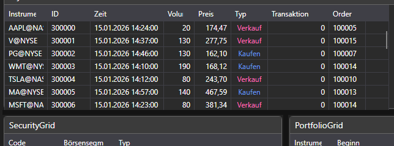

# Eigene Trades

[MyTradeGrid](xref:StockSharp.Xaml.MyTradeGrid) - eine Tabelle zur Anzeige eigener Trades.



**Wichtigste Member**

- [MyTradeGrid.Trades](xref:StockSharp.Xaml.MyTradeGrid.Trades) - Liste der Trades.
- [MyTradeGrid.SelectedTrade](xref:StockSharp.Xaml.MyTradeGrid.SelectedTrade) - der ausgewählte Trade.
- [MyTradeGrid.SelectedTrades](xref:StockSharp.Xaml.MyTradeGrid.SelectedTrades) - ausgewählte Trades.

Unten ist ein Codebeispiel für die Verwendung. Das Codebeispiel stammt aus *Samples\/InteractiveBrokers\/SampleIB.*

```xaml
<Window x:Class="Sample.MyTradesWindow"
	xmlns="http://schemas.microsoft.com/winfx/2006/xaml/presentation"
	xmlns:x="http://schemas.microsoft.com/winfx/2006/xaml"
	xmlns:loc="clr-namespace:StockSharp.Localization;assembly=StockSharp.Localization"
	xmlns:xaml="http://schemas.stocksharp.com/xaml"
	Title="{x:Static loc:LocalizedStrings.MyTrades}" Height="284" Width="644">
	<xaml:MyTradeGrid x:Name="TradeGrid" x:FieldModifier="public" />
</Window>

```
```cs
private readonly Connector _connector = new Connector();
private void ConnectClick(object sender, RoutedEventArgs e)
{
		...............................................
		_connector.OwnTradeReceived += trade => _myTradesWindow.TradeGrid.Trades.Add(trade);

		...............................................
}

```
