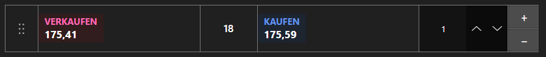

# Schnellhandelspanel



[QuickOrderPanel](xref:StockSharp.Xaml.QuickOrderPanel) - ein kompaktes Panel für Orders mit einem Klick. Es zeigt die besten Kauf\- und Verkaufspreise, den Spread und das Ordervolumen; ein Klick auf eine Seite erzeugt sofort eine Order.

**Haupteigenschaften**

- [QuickOrderPanel.Security](xref:StockSharp.Xaml.QuickOrderPanel.Security) - Instrument, für das Orders erzeugt werden.
- [QuickOrderPanel.Volume](xref:StockSharp.Xaml.QuickOrderPanel.Volume) - Ordervolumen.
- [QuickOrderPanel.BuyBackground](xref:StockSharp.Xaml.QuickOrderPanel.BuyBackground) - Hintergrund der Kaufseite.
- [QuickOrderPanel.SellBackground](xref:StockSharp.Xaml.QuickOrderPanel.SellBackground) - Hintergrund der Verkaufsseite.

Das Panel registriert Orders nicht selbst \- es erzeugt nur ein [Order](xref:StockSharp.BusinessEntities.Order)\-Objekt und übergibt es dem Ereignis `RegisterOrder`. Portfolio und zusätzliche Prüfungen kommen in den Handler. Änderungen an Volumen oder Darstellung lösen `SettingsChanged` aus, was sich zum Speichern der Einstellungen anbietet.

Nachfolgend Codeausschnitte zur Verwendung:

```xaml
<Window x:Class="Sample.QuickOrderWindow"
	xmlns="http://schemas.microsoft.com/winfx/2006/xaml/presentation"
	xmlns:x="http://schemas.microsoft.com/winfx/2006/xaml"
	xmlns:xaml="http://schemas.stocksharp.com/xaml"
	Height="300" Width="260">
	<xaml:QuickOrderPanel x:Name="QuickOrderPanel" Volume="10" />
</Window>
```

```cs
// Instrument setzen - das Panel abonniert dessen beste Preise
QuickOrderPanel.Security = _security;

// Das Panel erzeugt die Order, wir registrieren sie selbst
QuickOrderPanel.RegisterOrder += order =>
{
	order.Portfolio = _portfolio;
	_connector.RegisterOrder(order);
};

// Einstellungen bei Änderung speichern
QuickOrderPanel.SettingsChanged += () => SaveSettings();
```

## Siehe auch

[Handel](../trading.md)
