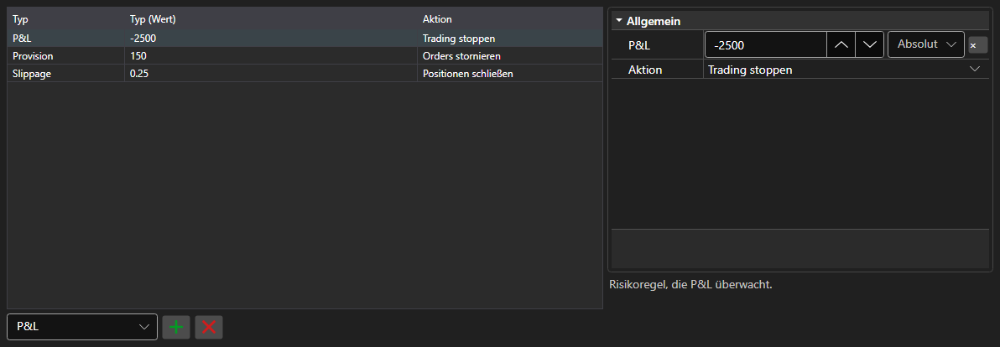

# Regeln des Risikomanagements



[RiskPanel](xref:StockSharp.Xaml.RiskPanel) - eine Tabelle der Risikomanagement\-Regeln. Sie erlaubt das Hinzufügen, Entfernen und Bearbeiten von [IRiskRule](xref:StockSharp.Algo.Risk.IRiskRule)\-Regeln: Jede Regel hat eine Auslösebedingung und eine Aktion.

**Haupteigenschaften**

- [RiskPanel.Rules](xref:StockSharp.Xaml.RiskPanel.Rules) - Liste der Regeln; dieselbe Liste, die [IRiskManager](xref:StockSharp.Algo.Risk.IRiskManager) verwendet.

Links steht die Regelliste: Typ, Bedingungswert und Aktion beim Auslösen. Rechts stehen die Eigenschaften der gewählten Regel, je Typ andere. Eine neue Regel entsteht über die Typauswahl unter der Tabelle, eine überflüssige entfernt die Schaltfläche daneben. Spaltenaufbau und Breiten werden mit `Save` und `Load` gespeichert.

Nachfolgend Codeausschnitte zur Verwendung:

```xaml
<Window x:Class="Sample.RiskWindow"
	xmlns="http://schemas.microsoft.com/winfx/2006/xaml/presentation"
	xmlns:x="http://schemas.microsoft.com/winfx/2006/xaml"
	xmlns:xaml="http://schemas.stocksharp.com/xaml"
	Height="400" Width="700">
	<xaml:RiskPanel x:Name="RiskPanel" />
</Window>
```

```cs
// Regeln des aktuellen Risikomanagers anzeigen
RiskPanel.Rules.AddRange(_connector.RiskManager.Rules);

// Regel hinzufügen: Handel bei Verlust stoppen
RiskPanel.Rules.Add(new RiskPnLRule
{
	PnL = -1000,
	Action = RiskActions.StopTrading,
});

// Bearbeitete Regeln an den Risikomanager zurückgeben
_connector.RiskManager.Rules.Clear();
_connector.RiskManager.Rules.AddRange(RiskPanel.Rules);
```

## Siehe auch

[Handel](../trading.md)
