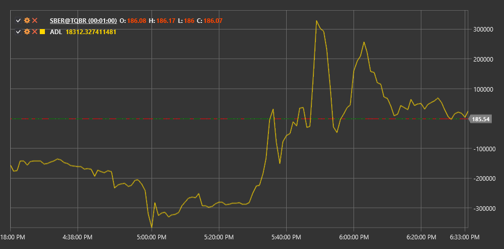

# ADL

**Akkumulations-/Distributionslinie (ADL)** ist ein von Mark Chaikin entwickelter Volumenindikator. Der Indikator bewertet das Verhältnis von Angebot und Nachfrage im Markt, indem er die Korrelation zwischen Preis und Volumen analysiert.

Zur Verwendung des Indikators müssen Sie die Klasse [AccumulationDistributionLine](xref:StockSharp.Algo.Indicators.AccumulationDistributionLine) verwenden.

## Beschreibung

Die Akkumulations-/Distributionslinie ist ein kumulativer Indikator, der Volumen und Preis verwendet, um festzustellen, ob sich ein Wertpapier in einer Akkumulationsphase (Kauf) oder Distributionsphase (Verkauf) befindet.

Der ADL-Indikator hilft, einen Trend zu bestätigen oder vor einer möglichen Umkehr zu warnen:
- Wenn der Preis steigt und ADL fällt, kann dies Schwäche in einem Aufwärtstrend signalisieren.
- Wenn der Preis fällt und ADL steigt, kann dies auf eine mögliche Umkehr eines Abwärtstrends hindeuten.

## Berechnung

Die Berechnung der Akkumulations-/Distributionslinie erfolgt in zwei Schritten:

**1. Berechnung des Volumenmultiplikators (CLV - Schlusskurspositionswert):**
```
CLV = ((Close - Low) - (High - Close)) / (High - Low)
```

**2. ADL-Berechnung:**
```
ADL = Previous ADL Value + CLV * Volume
```

Wobei:
- Close - Schlusskurs der Periode
- Low - Mindestpreis der Periode
- High - Höchstpreis der Periode
- Volume - Handelsvolumen der Periode

Wenn (High - Low) gleich null ist, wird CLV auf null gesetzt.



## Siehe auch

[OBV](on_balance_volume.md)
