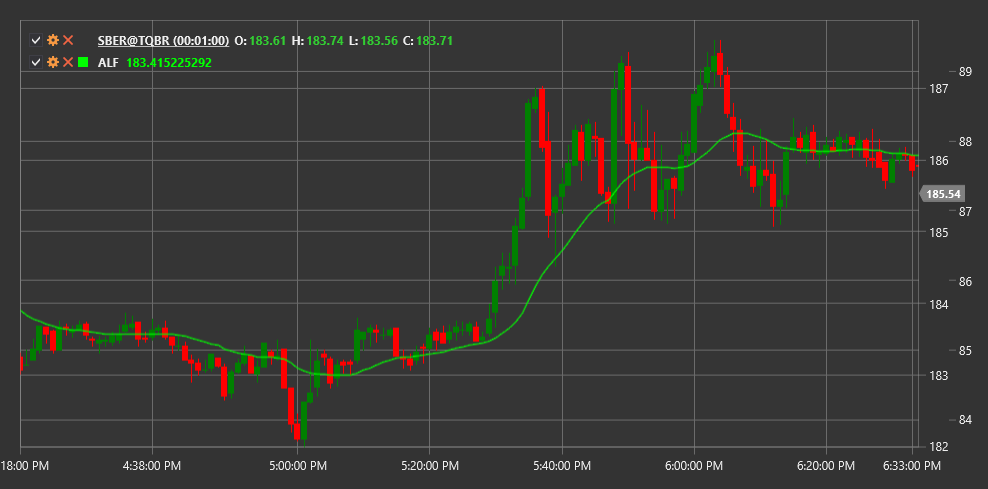

# ALF

**Adaptive Laguerre Filter (ALF)** ist ein Indikator, der entwickelt wurde, um Preisdaten mit minimaler Verzögerung zu glätten. Er basiert auf den mathematischen Prinzipien des Laguerre-Filters.

Zur Verwendung des Indikators müssen Sie die Klasse [AdaptiveLaguerreFilter](xref:StockSharp.Algo.Indicators.AdaptiveLaguerreFilter) verwenden.

## Beschreibung

Der Adaptive Laguerre Filter ist ein fortgeschrittenes Werkzeug zum Filtern von Marktrauschen. Er liefert eine glattere Darstellung der Preisbewegung und behält gleichzeitig eine schnelle Reaktion auf echte Trendänderungen bei. Dieser Filter ist besonders nützlich, um die Verzögerung zu reduzieren, die bei klassischen Glättungsindikatoren häufig auftritt.

Der Hauptvorteil von ALF gegenüber klassischen gleitenden Durchschnitten liegt in seiner Fähigkeit, Marktrauschen effektiver von echten Preisbewegungen zu trennen. Dadurch ist er ein wertvolles Werkzeug für Trader, die Fehlsignale reduzieren möchten.

## Parameter

Der Indikator hat die folgenden Parameter:
- **Gamma** - Filterkoeffizient (typischerweise im Bereich von 0,1 bis 0,9)

Der Parameter Gamma bestimmt den Glättungsgrad: niedrigere Werte erzeugen eine glattere Linie mit größerer Verzögerung, während höhere Werte zu weniger Glättung, aber schnellerer Reaktion auf Preisänderungen führen.

## Berechnung

Der Adaptive Laguerre Filter basiert auf Laguerre-Polynomen und stellt ein Filterungssystem mit endlicher Impulsantwort (FIR) dar. Die Berechnung verwendet die folgenden Formeln:

1. Zwischenwerte L0, L1, L2 und L3 werden berechnet:
   ```
   L0(t) = (1 - γ) * price(t) + γ * L0(t-1)
   L1(t) = -γ * L0(t) + L0(t-1) + γ * L1(t-1)
   L2(t) = -γ * L1(t) + L1(t-1) + γ * L2(t-1)
   L3(t) = -γ * L2(t) + L2(t-1) + γ * L3(t-1)
   ```

2. Der endgültige ALF-Wert wird als Durchschnitt berechnet:
   ```
   ALF = (L0 + L1 + L2 + L3) / 4
   ```

Wobei:
- γ (gamma) - Filterkoeffizient
- price(t) - aktueller Preis
- L0, L1, L2, L3 - Zwischenwerte des Filters



## Siehe auch

[LaguerreRSI](laguerre_rsi.md)
[ZLEMA](zero_lag_exponential_moving_average.md)
