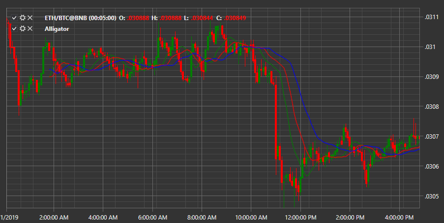

# Alligator

Der Indikator **Alligator** besteht aus einer Gruppe von drei gleitenden Durchschnitten. Diese gleitenden Durchschnitte haben unterschiedliche Perioden und sind außerdem im Chart nach vorne verschoben.

Zur Verwendung des Indikators sollte die Klasse [Alligator](xref:StockSharp.Algo.Indicators.Alligator) verwendet werden.
##### Merkmale des Indikators "Alligator"

Der Indikator besteht aus drei unterschiedlich gefärbten Linien:

- Blau, als Kiefer bezeichnet, mit einer Berechnungsperiode von 13 und einer Verschiebung um 8 Balken. Befindet er sich unter der Preiskurve, deutet dies auf eine mögliche Aufwärtsbewegung des Preises hin. Steigt der "Kiefer" darüber, wird ein Rückgang erwartet.

- Rot, als Zähne des Alligators bezeichnet, mit einer Periode von 8 und einer Verschiebung um 5 Balken. Diese Linie gehört zu den schnellen Durchschnitten und zeigt das Preisverhalten im Stundenbereich.

- Grün, als Lippen bezeichnet, mit einer Periode von 5 und einer Verschiebung um 3 Balken. Sie analysiert zwölfminütige Markttrends.

Die Werte beziehen sich auf den klassischen Indikator; in den Einstellungen können jederzeit eigene Parameter angegeben werden.

## Siehe auch

[ADX](adx.md)
