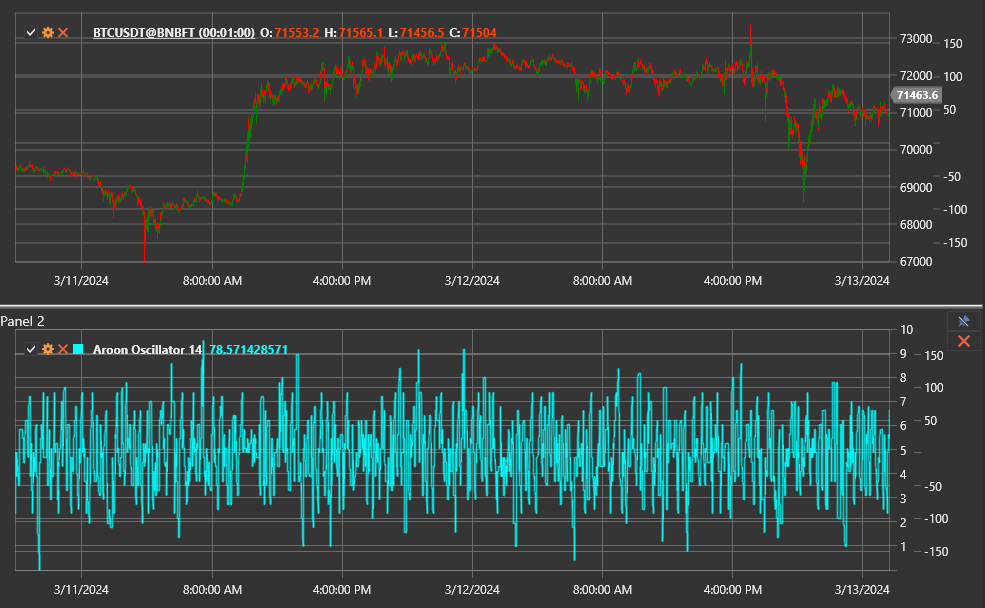

# Aroon Oscillator

Der **Aroon Oscillator** misst die Differenz zwischen den Linien Aroon Up und Aroon Down. Er hebt hervor, welche Marktseite dominiert
und wie stark der aktuelle Trend ist.

Verwenden Sie die Klasse [AroonOscillator](xref:StockSharp.Algo.Indicators.AroonOscillator), um mit diesem Indikator zu arbeiten.

## Beschreibung

Der Oszillator schwankt zwischen -100 und +100:

- positive Werte zeigen, dass Aroon Up über Aroon Down liegt und der Markt von Käufern dominiert wird;
- negative Werte zeigen, dass Aroon Down führt und die Bären die Kontrolle haben;
- Werte um null spiegeln Gleichgewicht oder Konsolidierung wider.

Je weiter sich der Wert von null entfernt, desto stärker ist die gerichtete Bewegung.

## Parameter

- **Length** - Periode, die für die zugrunde liegenden Aroon-Berechnungen verwendet wird. Größere Werte liefern glattere Signale mit langsamerer Reaktion.

## Berechnung

1. Berechnen Sie die Reihen Aroon Up und Aroon Down mit dem ausgewählten `Length`.
2. Subtrahieren Sie die beiden Linien:
   `Aroon Oscillator = Aroon Up - Aroon Down`.

## Interpretation

- **Aroon Oscillator > 0** - bullische Dominanz.
- **Aroon Oscillator < 0** - bärische Dominanz.
- **Kreuzung der Nulllinie** - mögliche Verschiebung des vorherrschenden Trends.
- **Extremwerte** - starker gerichteter Trend, häufig als Richtungsfilter verwendet.

Der Oszillator wird häufig zusammen mit dem Basisindikator [Aroon](aroon.md) analysiert, um sowohl absolute Niveaus als auch deren
Differenz zu beobachten.

## Siehe auch

[Aroon](aroon.md)
[ADX](adx.md)
[DMI](dmi.md)
