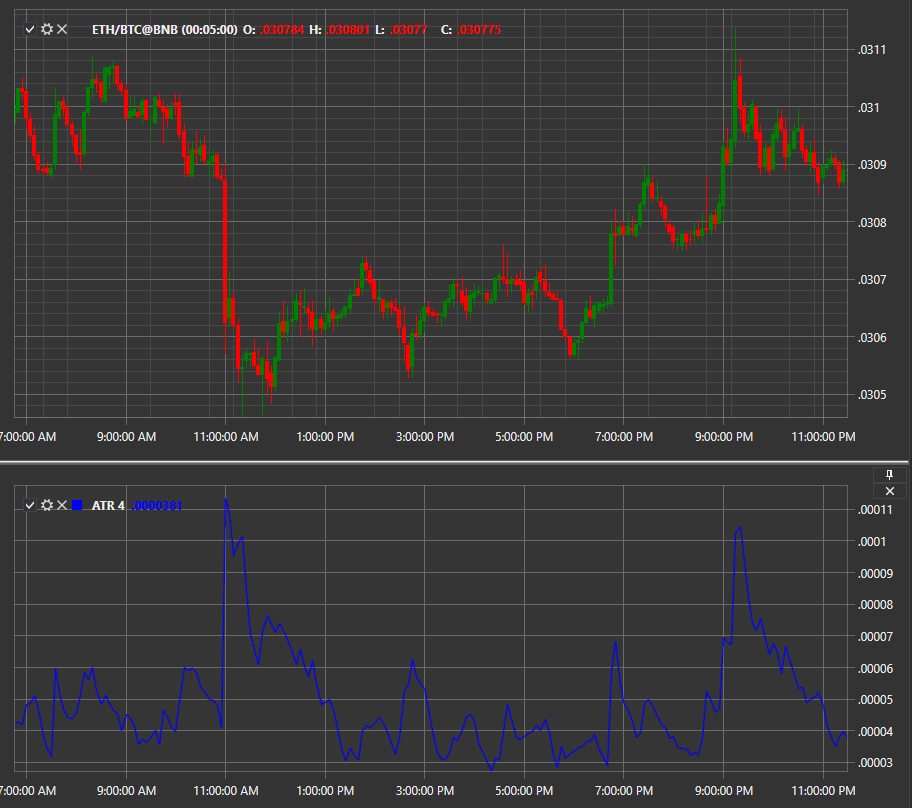

# ATR

**Average True Range (ATR)** ist ein Indikator, der das Niveau der aktuellen Volatilität zeigt.

Zur Verwendung des Indikators sollte die Klasse [AverageTrueRange](xref:StockSharp.Algo.Indicators.AverageTrueRange) verwendet werden.
##### Berechnung des Indikators
  
Die Berechnung des Indikators beginnt mit der Bestimmung der True Range (TR), die als Maximum der folgenden drei Werte berechnet wird:  
- Differenz zwischen aktuellem Maximum und Minimum;  
- Differenz zwischen aktuellem Maximum und vorherigem Schlusskurs (Absolutwert);  
- Differenz zwischen aktuellem Minimum und vorherigem Schlusskurs (Absolutwert).  

TRt = max(High(t)-Low(t); High(t) - Close(t-1); Close(t-1)-Low(t))  

Der Absolutwert wird verwendet, um positive Werte sicherzustellen, da die Entfernung zwischen zwei Punkten interessiert und nicht die Richtung der Preisbewegung.  
  
Auf Basis dieses Indikators wird ATR berechnet. Er hat nur einen Parameter - die Periode N. Standardmäßig wird ein 14-periodiger Indikator verwendet, er kann aber an die eigene Strategie angepasst werden. Die Formel sieht wie folgt aus (dies ist eine Form des exponentiellen gleitenden Durchschnitts):  
  
ATR(t) = ((ATR(t-1) x (N-1)) + TR(t)) / N  

## Siehe auch

[AO](ao.md)
