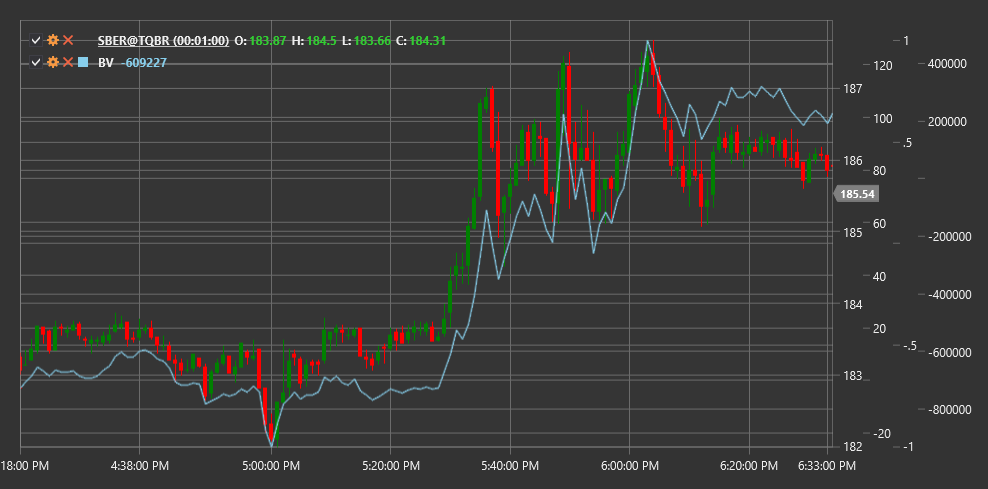

# BV

**Bilanzvolumen (BV)** ist ein technischer Indikator, der Akkumulation und Distribution des Handelsvolumens anhand von Preisänderungen verfolgt.

Zur Verwendung des Indikators müssen Sie die Klasse [BalanceVolume](xref:StockSharp.Algo.Indicators.BalanceVolume) verwenden.

## Beschreibung

Der Balance-Volume-Indikator (BV) dient zur Analyse der Beziehung zwischen Preisänderung und Handelsvolumen. Er hilft Tradern zu bestimmen, wie Volumenänderungen mit der Preisbewegung übereinstimmen, was auf Stärke oder Schwäche des aktuellen Trends hinweisen kann.

Die Grundidee von BV lautet, dass das Volumen die Preisrichtung bestätigen sollte. Steigt der Preis bei zunehmendem Volumen, deutet dies auf einen starken Aufwärtstrend hin. Umgekehrt deutet ein fallender Preis bei zunehmendem Volumen auf einen starken Abwärtstrend hin.

Der BV-Indikator ist besonders nützlich für:
- Bestätigung der Stärke des aktuellen Trends
- Erkennen potenzieller Trendumkehrungen
- Erkennen von Divergenzen zwischen Preis und Volumen
- Bestimmen von Akkumulations- und Distributionsniveaus

## Berechnung

Die Berechnung des Balance-Volume-Indikators basiert auf dem Vergleich des Schlusskurses mit dem vorherigen Schlusskurs und der Gewichtung des Handelsvolumens:

```
Wenn Close > vorheriger Schlusskurs:
	BV = vorheriger BV + Volume
Wenn Close < vorheriger Schlusskurs:
	BV = vorheriger BV - Volume
Wenn Close = vorheriger Schlusskurs:
	BV = vorheriger BV
```

Wobei:
- Close - aktueller Schlusskurs
- vorheriger Schlusskurs - vorheriger Schlusskurs
- Volume - aktuelles Handelsvolumen
- vorheriger BV - vorheriger Wert des Balance-Volume-Indikators

## Interpretation

- **BV steigt bei Preissteigerung** - Bestätigung eines Aufwärtstrends, zeigt starkes Käuferinteresse an
- **BV fällt bei Preisrückgang** - Bestätigung eines Abwärtstrends, zeigt starkes Verkäuferinteresse an
- **BV steigt bei stabilem oder fallendem Preis** - potenzielle Akkumulation, kann einer Aufwärtsumkehr vorausgehen
- **BV fällt bei stabilem oder steigendem Preis** - potenzielle Distribution, kann einer Abwärtsumkehr vorausgehen
- **Divergenz zwischen BV und Preis** - Warnung vor einer möglichen Trendumkehr:
  - Wenn der Preis steigt, während BV fällt, kann eine schnelle Abwärtsumkehr bevorstehen
  - Wenn der Preis fällt, während BV steigt, kann eine schnelle Aufwärtsumkehr bevorstehen



## Siehe auch

[OBV](on_balance_volume.md)
[ADL](accumulation_distribution_line.md)
[ChaikinMoneyFlow](chaikin_money_flow.md)
[ForceIndex](force_index.md)
