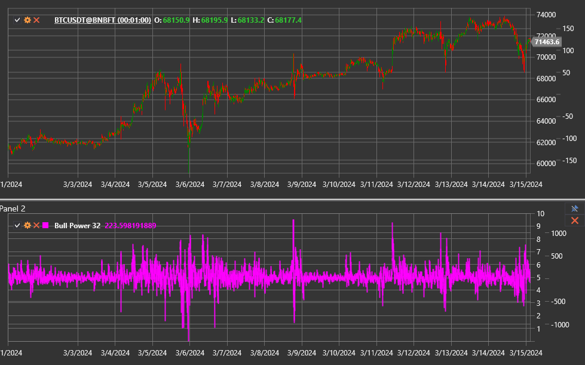

# Bull Power

**Bull Power** ist das bullische Gegenstück innerhalb des Elder-Ray-Systems. Er misst, wie stark Käufer die Preise über einen
exponentiellen gleitenden Durchschnitt (EMA) treiben, indem das Balkenhoch mit dem Durchschnittspreis verglichen wird.

Verwenden Sie die Klasse [BullPower](xref:StockSharp.Algo.Indicators.BullPower), um mit diesem Indikator zu arbeiten.

## Beschreibung

Der Indikator verwendet die Formel:

`Bull Power = High - EMA`.

- Positive Werte bestätigen bullischen Druck und unterstützen einen steigenden Trend.
- Fallende Werte in Richtung null oder unter null signalisieren schwächer werdende Bullen.
- Extreme Spitzen können Korrekturen vorausgehen, insbesondere wenn die EMA nach unten zeigt.

## Parameter

Bull Power übernimmt seine Parameter von [ExponentialMovingAverage](xref:StockSharp.Algo.Indicators.ExponentialMovingAverage):

- **Length** - EMA-Periode.
- **Alpha** (optional) - Glättungskoeffizient, wenn anwendbar.

## Verwendung

- Steigender Bull Power zusammen mit einer steigenden EMA bestätigt die Trendstärke.
- Wenn der Preis neue Hochs erreicht, ohne dass Bull Power höhere Werte erreicht, entsteht eine bärische Divergenz.
- Kombinieren Sie Bull und Bear Power mit der Preis-EMA, um die vollständige Struktur von [Elder Ray](elder_ray.md) zu bewerten.

## Siehe auch

[Bear Power](bear_power.md)
[Elder Ray](elder_ray.md)
[ExponentialMovingAverage](ema.md)
