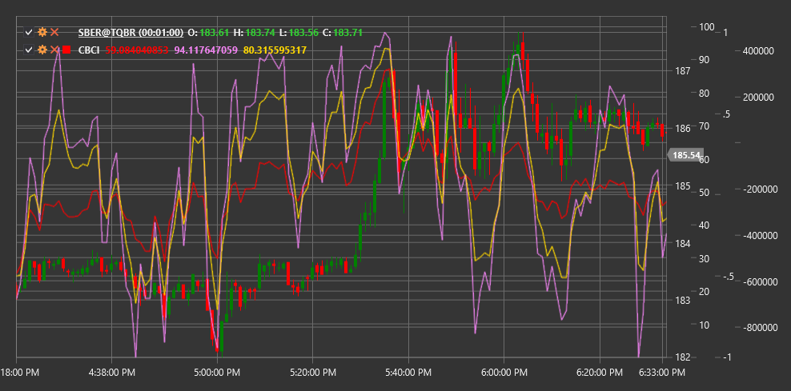

# CBCI

**Constance Brown Composite Index (CBCI)** ist ein von Constance Brown entwickelter Indikator, der Elemente verschiedener technischer Indikatoren zu einem umfassenden Marktanalysetool kombiniert.

Um den Indikator verwenden zu können, müssen Sie die Klasse [ConstanceBrownCompositeIndex](xref:StockSharp.Algo.Indicators.ConstanceBrownCompositeIndex) verwenden.

## Beschreibung

Der Constance Brown Composite Index (CBCI) wurde entwickelt, um die Stärken mehrerer Indikatoren in einem umfassenden Tool zusammenzuführen. Es enthält Elemente des stochastischen Oszillators RSI und anderer Oszillatoren, um genauere Signale über potenzielle Marktumkehrungen und Trendbewegungen zu liefern.

CBCI ist konzipiert für:
- Identifizierung potenzieller Trendumkehrpunkte
- Ermittlung überkaufter und überverkaufter Niveaus
- Erkennen versteckter Abweichungen
- Bestätigung der Stärke des aktuellen Trends

Der Indikator funktioniert gut über verschiedene Zeitrahmen und Markttypen hinweg, einschließlich Aktien-, Devisen- und Rohstoffmärkte.

## Parameter

Der Indikator hat die folgenden Parameter:
- **Length** – Hauptberechnungszeitraum für den Index (Standardwert: 14)
- **StochasticKPeriod** – Zeitraum zur Berechnung des stochastischen Oszillators %K (Standardwert: 5)
- **StochasticDPeriod** – Zeitraum zur Berechnung des stochastischen Oszillators %D (Standardwert: 3)

## Berechnung

Die CBCI-Berechnung umfasst die folgenden Schritte:

1. Berechnen Sie RSI über den Length-Zeitraum:
   ```
   RSI = 100 - (100 / (1 + RS))
   RS = Average Gain / Average Loss
   ```

2. Berechnen Sie den stochastischen Oszillator:
   ```
   %K = ((Close - Lowest Low) / (Highest High - Lowest Low)) * 100
   %D = SMA(%K, StochasticDPeriod)
   ```

3. Kombinieren Sie RSI und stochastischen Oszillator:
   ```
   CBCI = (RSI + %K + %D) / 3
   ```

Dieser kombinierte Index kann dann geglättet werden, um das Rauschen zu reduzieren.

## Interpretation

- **Überkaufte und überverkaufte Niveaus**:
  - Werte über 80 können auf überkaufte Marktbedingungen hinweisen
  - Werte unter 20 können auf überverkaufte Marktbedingungen hinweisen

- **Mittellinienkreuzungen**:
  - Ein Überschreiten der 50-Linie von unten nach oben kann als bullisches Signal gewertet werden
  - Ein Überschreiten der 50-Linie von oben nach unten kann als bärisches Signal gewertet werden

- **Abweichungen**:
  - Klassische Divergenzen: wenn sich Preis und CBCI in entgegengesetzte Richtungen bewegen
  - Versteckte Divergenzen: Wenn Preis und CBCI unterschiedliche Arten von Hochs oder Tiefs erzeugen

- **Trendbewegung**:
  - Wenn CBCI dauerhaft über 50 bleibt, kann dies auf einen starken Aufwärtstrend hinweisen
  - Wenn CBCI dauerhaft unter 50 bleibt, kann dies auf einen starken Abwärtstrend hinweisen



## Siehe auch

[RSI](rsi.md)
[StochasticOscillator](stochastic_oscillator.md)
[StochasticK](stochastic_oscillator_k.md)
[CCI](cci.md)
