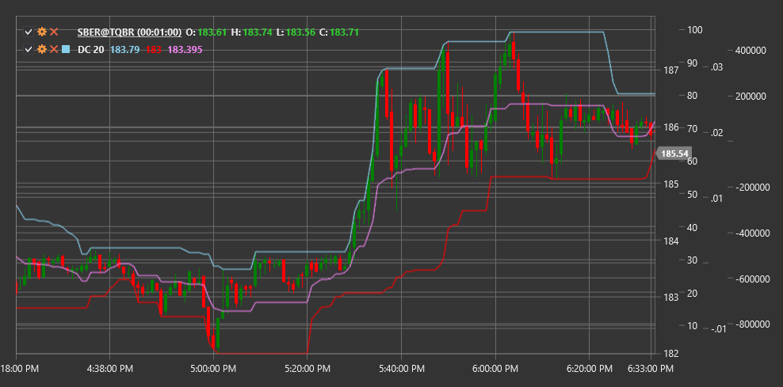

# DC

**Donchian-Kanäle (DC)** ist ein vom Händler Richard Donchian entwickelter technischer Indikator, der aus einem oberen und unteren Band (Kanalgrenzen) besteht, die auf den maximalen und minimalen Preiswerten über einen bestimmten Zeitraum basieren.

Um den Indikator verwenden zu können, müssen Sie die Klasse [DonchianChannels](xref:StockSharp.Algo.Indicators.DonchianChannels) verwenden.

## Beschreibung

Donchian-Kanäle ist ein einfacher, aber effektiver Volatilitäts- und Trendindikator. Der Indikator besteht aus drei Linien:
- obere Linie: höchstes Hoch im ausgewählten Zeitraum
- untere Linie: niedrigstes Tief im ausgewählten Zeitraum
- mittlere Linie: Durchschnittswert zwischen der oberen und unteren Linie

Dieser Indikator wurde erstmals von Richard Donchian in seiner 4-Wochen-Kanalregel verwendet, wonach ein Kaufsignal auftritt, wenn der Preis das höchste Hoch von 4 Wochen überschreitet, und ein Verkaufssignal, wenn der Preis unter das niedrigste Tief von 4 Wochen fällt.

Donchian-Kanäle sind nützlich für:
- Identifizierung der Marktvolatilität
- Bestimmung der Unterstützungs- und Widerstandsniveaus
- Erzeugen von Ausbruchssignalen
- Definieren der aktuellen Handelsspanne

## Parameter

Der Indikator hat die folgenden Parameter:
- **Length** – Berechnungszeitraum (Standardwert: 20)

## Berechnung

Die Donchian-Kanäle-Berechnung ist ganz einfach:

1. Obere Kanallinie:
   ```
   obere Linie = höchstes Hoch über Length-Periode
   ```

2. Untere Kanallinie:
   ```
   untere Linie = tiefstes Tief über Length-Periode
   ```

3. Mittlere Kanallinie:
   ```
   mittlere Linie = (obere Linie + untere Linie) / 2
   ```

## Interpretation

Donchian-Kanäle kann auf verschiedene Arten verwendet werden:

1. **Ausbruchsstrategien**:
   - Ein Durchbruch über die obere Kanallinie kann als Kaufsignal gewertet werden
   - Ein Durchbruch unter die untere Kanallinie kann als Verkaufssignal angesehen werden

2. **Trendbestimmung**:
   - Liegt der Preis in der oberen Hälfte des Kanals (oberhalb der Mittellinie), kann auf einen Aufwärtstrend geschlossen werden
   - Liegt der Preis in der unteren Hälfte des Kanals (unterhalb der Mittellinie), kann auf einen Abwärtstrend geschlossen werden

3. **Unterstützungs- und Widerstandsstufen**:
   - Die obere Kanallinie kann als Widerstandsniveau dienen
   - Die untere Kanallinie kann als Unterstützungsniveau dienen

4. **Volatilitätsmessung**:
   - Die Kanalbreite (Unterschied zwischen oberer und unterer Linie) zeigt die Marktvolatilität an
   - Die Kanalausweitung weist auf eine erhöhte Volatilität hin
   - Eine Kanalkontraktion weist auf eine verringerte Volatilität hin

5. **Gegentrend-Strategien**:
   - Einige Händler verwenden entgegengesetzte Signale und erwarten, dass der Preis nach Erreichen der Kanalränder zur Mittellinie zurückkehrt



## Siehe auch

[BollingerBands](bollinger_bands.md)
[KeltnerChannels](keltner_channels.md)
[Höchstwert](highest.md)
[Tiefstwert](lowest.md)
