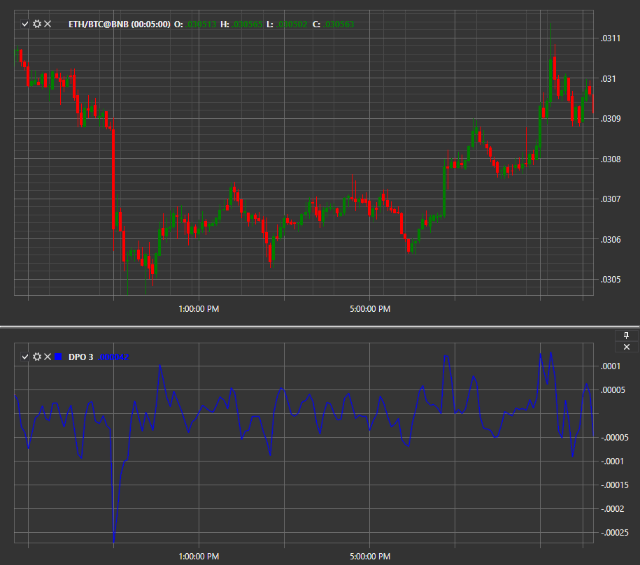

# DPO

**Trendbereinigter Preisoszillator (DPO)** ist ein Oszillator, der Preistrends eliminiert, um die Dauer von Preiszyklen von Höchststand zu Höchststand oder Tiefststand zu Tiefststand abzuschätzen. Im Gegensatz zu anderen Oszillatoren wie der stochastischen Konvergenz oder der gleitenden durchschnittlichen Konvergenzdivergenz (MACD) ist DPO kein Momentum-Indikator. Es hebt Preisspitzen und -tiefs hervor, die zur Schätzung von Ein- und Ausstiegspunkten verwendet werden.

Um den Indikator zu verwenden, sollte die Klasse [DetrendedPriceOscillator](xref:StockSharp.Algo.Indicators.DetrendedPriceOscillator) verwendet werden.

Der Trendbereinigter Preisoszillator wird berechnet, indem ein einfacher gleitender Durchschnitt (SMA) vom aktuellen Preiswert subtrahiert wird. Die Länge des gleitenden Durchschnitts wird vom Benutzer bestimmt.

## Siehe auch

[DMI](dmi.md)
