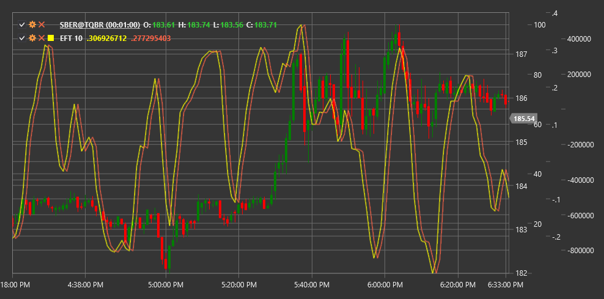

# EFT

**Ehlers-Fisher-Transformation (EFT)** ist ein von John Ehlers entwickelter technischer Indikator, der die statistische Fisher-Transformation nutzt, um Preisdaten in eine normalverteilte Form umzuwandeln.

Um den Indikator verwenden zu können, müssen Sie die Klasse [EhlersFisherTransform](xref:StockSharp.Algo.Indicators.EhlersFisherTransform) verwenden.

## Beschreibung

Der Ehlers-Fisher-Transformation basiert auf dem Konzept, dass Marktpreise keine Normalverteilung (Gaußverteilung) aufweisen. Stattdessen weisen sie häufig asymmetrische Verteilungen auf. Der Indikator wendet eine mathematische Fisher-Transformationsformel an, um diese asymmetrischen Verteilungen in normalverteilte Werte umzuwandeln.

Diese Transformation macht extreme Preisbewegungen deutlicher wahrnehmbar und hilft, Marktumkehrpunkte klarer zu erkennen. Wenn die Fisher-Transformation angewendet wird, steigen die Spitzenwerte stark an, wodurch Extreme im Marktverhalten deutlicher werden.

EFT ist besonders nützlich für:
- Ermittlung potenzieller Marktumkehrpunkte
- Identifizieren von überkauften und überverkauften Bedingungen
- Erkennen versteckter Abweichungen zwischen Preis und Indikator
- Generieren genauerer Ein- und Ausstiegssignale

## Parameter

Der Indikator hat die folgenden Parameter:
- **Length** – Berechnungszeitraum (Standardwert: 10)

## Berechnung

Die Ehlers-Fisher-Transformation-Berechnung umfasst mehrere Schritte:

1. Preisdaten in Werte zwischen -1 und +1 umwandeln (normalerweise unter Verwendung eines normalisierten Preisrangs oder eines anderen Oszillators):
   ```
   Value = (2 * ((Price - Min) / (Max - Min))) - 1
   ```
   Dabei sind Min und Max die Mindest- und Höchstpreise im Length-Zeitraum.

2. Wenden Sie die Fisher-Transformation an:
   ```
   Wenn Value >= 0.999, dann Value = 0.999
   Wenn Value <= -0.999, dann Value = -0.999

   Fisher = 0.5 * ln((1 + Value) / (1 - Value))
   ```
   wobei ln der natürliche Logarithmus ist.

3. Glätten, um Geräusche zu reduzieren:
   ```
   EFT = EMA(Fisher, Period)
   ```
   wobei EMA der exponentielle gleitende Durchschnitt ist.

## Interpretation

Der Ehlers-Fisher-Transformation kann wie folgt interpretiert werden:

1. **Extreme Werte**:
   - Werte über +2 weisen häufig auf überkaufte Marktbedingungen hin
   - Werte unter -2 weisen häufig auf überverkaufte Marktbedingungen hin

2. **Nulllinienübergänge**:
   - Das Überschreiten der Nulllinie von unten nach oben kann als bullisches Signal gewertet werden
   - Das Überschreiten der Nulllinie von oben nach unten kann als bärisches Signal gewertet werden

3. **Indikatorumkehr**:
   - Die Umkehr des Indikators von extremen Werten geht oft einer Preisumkehr voraus

4. **Abweichungen**:
   - Bullische Divergenz: Der Preis bildet ein neues Tief, während EFT ein höheres Tief bildet
   - Bärische Divergenz: Der Preis bildet ein neues Hoch, während EFT ein niedrigeres Hoch bildet

5. **Steigung der Indikatorlinie**:
   - Ein steiler Anstieg weist auf eine starke Aufwärtsdynamik hin
   - Ein steiler Abwärtstrend weist auf eine starke Abwärtsdynamik hin

Der Ehlers-Fisher-Transformation unterscheidet sich von vielen anderen Oszillatoren dadurch, dass er extreme Werte erreichen und dort einige Zeit verharren kann, ohne unbedingt sofort umzukehren. Dies macht es nützlich, um starke Trendbewegungen zu identifizieren.



## Siehe auch

[CenterOfGravityOscillator](center_of_gravity_oscillator.md)
[SineWave](sine_wave.md)
[HarmonicOscillator](harmonic_oscillator.md)
[RSI](rsi.md)
