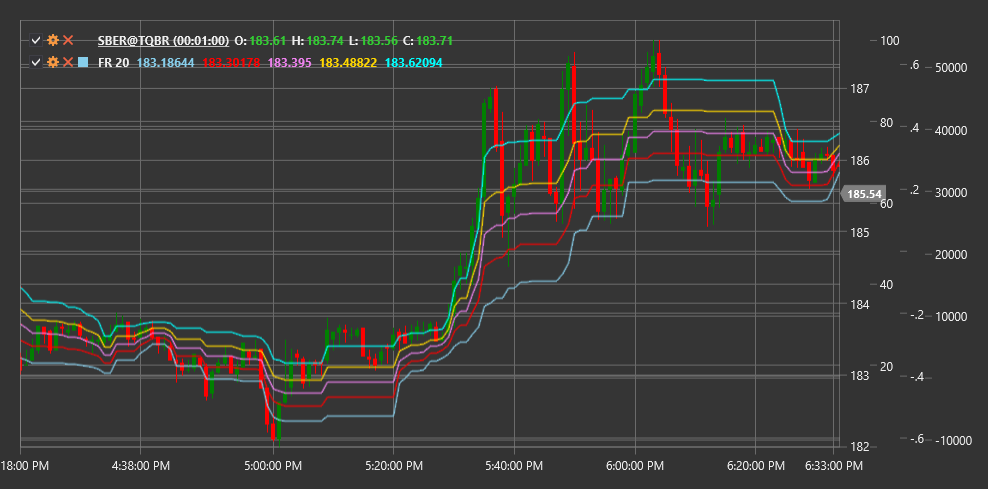

# FR

**Fibonacci Retracement (FR)** ist ein technischer Indikator, der auf Fibonacci-Zahlen basiert und dabei hilft, potenzielle Unterstützungs- und Widerstandsniveaus auf der Grundlage früherer Preisbewegungen zu identifizieren.

Um den Indikator verwenden zu können, müssen Sie die Klasse [FibonacciRetracement](xref:StockSharp.Algo.Indicators.FibonacciRetracement) verwenden.

## Beschreibung

Fibonacci Retracement ist ein beliebtes technisches Tool, das horizontale Linien verwendet, um Bereiche möglicher Unterstützung oder Widerstand auf einem Preisdiagramm anzuzeigen. Diese Werte basieren auf Fibonacci-Zahlen und den entsprechenden Prozentverhältnissen.

Der Indikator basiert auf der mathematischen Fibonacci-Folge, bei der jede Zahl die Summe der beiden vorhergehenden ist (1, 1, 2, 3, 5, 8, 13, 21, 34...). Aus dieser Reihenfolge werden die Schlüsselkennzahlen für die technische Analyse abgeleitet: 23,6 %, 38,2 %, 50 %, 61,8 % und 78,6 %.

Fibonacci Retracement wird auf eine signifikante Preisbewegung (Trend) angewendet und zeigt die Niveaus an, bei denen eine Korrektur (Pullback) auftreten kann, bevor die Richtung des Haupttrends fortgesetzt wird.

Der Indikator ist besonders nützlich für:
- Identifizieren potenzieller Unterstützungsniveaus in einem Aufwärtstrend
- Identifizieren potenzieller Widerstandsniveaus in einem Abwärtstrend
- Festlegung von Einstiegszielen nach einer Korrektur
- Festlegung der Niveaus für die Stop-Loss-Platzierung

## Parameter

Der Indikator hat die folgenden Parameter:
- **Length** – Zeitraum zur Feststellung einer signifikanten Preisbewegung (Standardwert hängt vom Zeitrahmen ab)

## Berechnung

Die Berechnung der Fibonacci Retracement-Werte umfasst die folgenden Schritte:

1. Feststellung einer signifikanten Preisbewegung (Trend):
   - Im Aufwärtstrend: von niedrig nach hoch
   - Im Abwärtstrend: von hoch nach niedrig

2. Berechnung der Korrekturstufen basierend auf der Reichweite dieser Bewegung:
   ```
   Range = |High - Low|

   Level 0% = High (for upward trend) or Low (for downward trend)
   Level 23.6% = High - (Range * 0.236) or Low + (Range * 0.236)
   Level 38.2% = High - (Range * 0.382) or Low + (Range * 0.382)
   Level 50.0% = High - (Range * 0.5) or Low + (Range * 0.5)
   Level 61.8% = High - (Range * 0.618) or Low + (Range * 0.618)
   Level 78.6% = High - (Range * 0.786) or Low + (Range * 0.786)
   Level 100% = Low (for upward trend) or High (for downward trend)
   ```

## Interpretation

Fibonacci Retracement-Stufen werden wie folgt interpretiert:

1. **Hauptkorrekturstufen**:
   - 23,6 % – schwaches Niveau, das während eines starken Trends oft durchbrochen wird
   - 38,2 % – moderates Niveau, entspricht einer typischen Korrektur
   - 50,0 % – psychologisch bedeutsames Niveau (allerdings keine Fibonacci-Zahl)
   - 61,8 % – „Goldener Schnitt“, das wichtigste Fibonacci-Niveau
   - 78,6 % – tiefe Korrektur, könnte auf eine mögliche Trendumkehr hinweisen

2. **Im Aufwärtstrend**:
   - Fibonacci-Niveaus dienen als potenzielle Unterstützungsniveaus
   - Das Abprallen von einem Fibonacci-Level kann ein Signal für den Einstieg in eine Long-Position sein
   - Das Durchbrechen mehrerer Fibonacci-Niveaus nach unten könnte auf eine Abschwächung des Trends hinweisen

3. **Im Abwärtstrend**:
   - Fibonacci-Niveaus dienen als potenzielle Widerstandsniveaus
   - Das Abprallen von einem Fibonacci-Level kann ein Signal für den Einstieg in eine Short-Position sein
   - Das Durchbrechen mehrerer Fibonacci-Niveaus nach oben könnte auf eine Abschwächung des Trends hinweisen

4. **Übereinstimmung mit anderen Ebenen**:
   - Fibonacci-Niveaus sind aussagekräftiger, wenn sie mit anderen wichtigen Niveaus (frühere Hochs/Tiefs, gleitende Durchschnitte usw.) zusammenfallen.

5. **Aufstellung verschiedener Zeitrahmen**:
   - Fibonacci-Niveaus, die in verschiedenen Zeitrahmen aufgetragen werden, können Häufungszonen erzeugen, in denen die Wahrscheinlichkeit einer Umkehr zunimmt



## Siehe auch

[PivotPoints](pivot_points.md)
