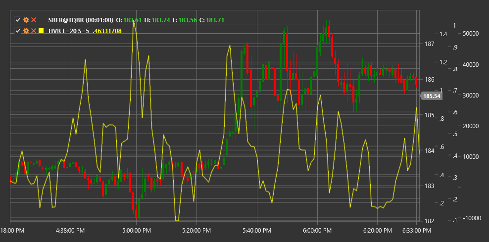

# HVR

**Historisches Volatilitätsverhältnis (HVR)** ist ein technischer Indikator, der die kurzfristige historische Volatilität mit der langfristigen historischen Volatilität vergleicht, um Veränderungen in der Marktaktivität zu beurteilen.

Um den Indikator verwenden zu können, müssen Sie die Klasse [HistoricalVolatilityRatio](xref:StockSharp.Algo.Indicators.HistoricalVolatilityRatio) verwenden.

## Beschreibung

Der Historisches Volatilitätsverhältnis (HVR) ist ein relativer Volatilitätsindikator, der die kurzfristige Volatilität mit der langfristigen Marktvolatilität vergleicht. Der Indikator hilft festzustellen, ob die aktuelle Volatilität im Vergleich zu ihrem historischen Niveau zunimmt oder abnimmt.

HVR wird als Verhältnis der kurzfristigen historischen Volatilität zur langfristigen historischen Volatilität berechnet. Werte über 1,0 weisen darauf hin, dass die aktuelle (kurzfristige) Volatilität höher ist als die langfristige Volatilität, was auf eine erhöhte Marktaktivität oder eine mögliche Trendwende hinweisen kann.

Der Indikator ist besonders nützlich für:
- Identifizieren von Perioden hoher und niedriger Volatilität
- Ermittlung potenzieller Trendumkehrpunkte
- Anpassung der Handelsstrategien an die aktuellen Marktbedingungen
- Bewertung des Marktrisikos und Festlegung geeigneter Positionsgrößen

## Parameter

Der Indikator hat die folgenden Parameter:
- **ShortPeriod** – Zeitraum zur Berechnung der kurzfristigen Volatilität (Standardwert: 5)
- **LongPeriod** – Zeitraum zur Berechnung der langfristigen Volatilität (Standardwert: 20)

## Berechnung

Die Historisches Volatilitätsverhältnis-Berechnung umfasst die folgenden Schritte:

1. Berechnen Sie die kurzfristige historische Volatilität:
   ```
   Kurzfristige Volatilität = Standardabweichung der Log-Returns über ShortPeriod * Sqrt(Handelstage pro Jahr)
   ```

2. Berechnen Sie die langfristige historische Volatilität:
   ```
   Langfristige Volatilität = Standardabweichung der Log-Returns über LongPeriod * Sqrt(Handelstage pro Jahr)
   ```

3. Berechnen Sie HVR als Verhältnis der kurzfristigen Volatilität zur langfristigen Volatilität:
   ```
   HVR = Kurzfristige Volatilität / Langfristige Volatilität
   ```

Dabei gilt:
- Log-Returns – logarithmische Renditen (ln(Price[i] / Price[i-1]))
- Standardabweichung - Standardabweichung
- Handelstage pro Jahr – Anzahl der Handelstage in einem Jahr (normalerweise 252 für Aktienmärkte)
- ShortPeriod – kurzer Zeitraum für die Volatilitätsberechnung
- LongPeriod – langer Zeitraum für die Volatilitätsberechnung

## Interpretation

Der Historisches Volatilitätsverhältnis kann wie folgt interpretiert werden:

1. **Stufe 1.0**:
   - HVR = 1,0 bedeutet, dass die kurzfristige Volatilität gleich der langfristigen Volatilität ist
   - HVR > 1,0 zeigt an, dass die kurzfristige Volatilität höher ist als die langfristige Volatilität
   - HVR < 1,0 zeigt an, dass die kurzfristige Volatilität geringer ist als die langfristige Volatilität

2. **Extreme Werte**:
   - Sehr hohe HVR-Werte (z. B. > 2,0) können auf einen starken Anstieg der Volatilität hinweisen, der häufig bei Marktpaniken oder starken Bewegungen auftritt
   - Sehr niedrige HVR-Werte (z. B. < 0,5) können auf eine Volatilitätskompressionsperiode hinweisen, die häufig starken Bewegungen vorausgeht

3. **HVR-Trends**:
   - Steigender HVR deutet auf einen Anstieg der aktuellen Volatilität hin
   - Ein fallender HVR deutet auf einen Rückgang der aktuellen Volatilität hin

4. **Handelsstrategien**:
   - Wenn HVR hoch ist, kann es angebracht sein, ausbruchsbasierte Strategien zu verwenden
   - Wenn HVR niedrig ist, sind Mean-Reversion- oder Range-Trading-Strategien möglicherweise besser geeignet

5. **Risikomanagement**:
   - High HVR-Werte können auf die Notwendigkeit hinweisen, die Positionsgrößen aufgrund erhöhter Volatilität zu reduzieren
   - Niedrige HVR-Werte können aufgrund der geringeren Volatilität größere Positionsgrößen ermöglichen

6. **Mögliche Umkehrungen**:
   - Extreme HVR-Werte gehen häufig erheblichen Preisbewegungen voraus
   - Ein starker HVR-Anstieg nach einer Phase geringer Volatilität könnte den Beginn eines neuen Trends signalisieren



## Siehe auch

[ATR](atr.md)
[StandardDeviation](standard_deviation.md)
[ChoppinessIndex](choppiness_index.md)
