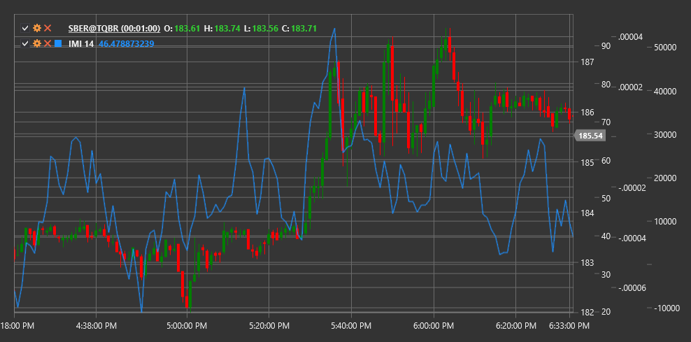

# IMI

**Intraday-Momentum-Index (IMI)** ist ein von Tushar Chande entwickelter technischer Indikator, der Intraday-Preisprinzipien und das RSI-Konzept kombiniert, um die Intraday-Momentum zu messen.

Um den Indikator verwenden zu können, müssen Sie die Klasse [IntradayMomentumIndex](xref:StockSharp.Algo.Indicators.IntradayMomentumIndex) verwenden.

## Beschreibung

Der Intraday-Momentum-Index (IMI) wurde als Modifikation des klassischen Relative-Stärke-Index (RSI) erstellt und speziell für die Analyse der Intraday-Marktdynamik angepasst. Anstatt sequenzielle Schlusskurse zu verwenden, wie beim herkömmlichen RSI, vergleicht IMI den Schlusskurs mit dem Eröffnungskurs für jede Periode.

IMI bewertet, wie oft und wie stark der Schlusskurs über einen bestimmten Zeitraum den Eröffnungskurs übersteigt (positives Momentum) oder unter den Eröffnungskurs fällt (negatives Momentum). Dies ermöglicht die Identifizierung der vorherrschenden Richtung und Stärke der Intraday-Bewegung.

Der Indikator ist besonders nützlich für:
- Bestimmung der Intraday-Marktrichtung
- Identifizieren potenzieller Umkehrpunkte
- Ermittlung überkaufter und überverkaufter Niveaus
- Erkennen von Divergenzen zwischen Preis und Dynamik

## Parameter

Der Indikator hat die folgenden Parameter:
- **Length** – Berechnungszeitraum (Standardwert: 14)

## Berechnung

Die Intraday-Momentum-Index-Berechnung umfasst die folgenden Schritte:

1. Bestimmen Sie die Intraday-Preisbewegung:
   ```
   Gain = Close - Open, if Close > Open
   Loss = Open - Close, if Close < Open
   ```

2. Berechnen Sie die Summe der positiven und negativen Bewegungen über den Length-Zeitraum:
   ```
   Sum Gains = Summe aller Gains über Length-Periode
   Sum Losses = Summe aller Losses über Length-Periode
   ```

3. Berechnen Sie IMI mit einer Formel ähnlich der von RSI:
   ```
   IMI = 100 * (Sum Gains / (Sum Gains + Sum Losses))
   ```

Hinweis: Wenn (Sum-Gewinne + Sum-Verluste) gleich Null sind, wird IMI auf 50 gesetzt, um eine Division durch Null zu vermeiden.

## Interpretation

Der Intraday-Momentum-Index wird ähnlich wie RSI interpretiert:

1. **Wertebereich**:
   - IMI schwankt zwischen 0 und 100
   - Werte über 50 deuten auf ein vorherrschendes positives Intraday-Momentum hin
   - Werte unter 50 weisen auf ein vorherrschendes negatives Intraday-Momentum hin

2. **Überkaufte und überverkaufte Niveaus**:
   - Werte über 70 werden typischerweise als Anzeichen für überkaufte Marktbedingungen angesehen
   - Werte unter 30 werden typischerweise als Hinweis auf überverkaufte Marktbedingungen angesehen

3. **Mittellinienkreuzungen**:
   - Das Überschreiten der 50-Linie von unten nach oben kann als bullisches Signal gewertet werden
   - Das Überschreiten der 50-Linie von oben nach unten kann als bärisches Signal gewertet werden

4. **Abweichungen**:
   - Bullische Divergenz: Der Preis bildet ein neues Tief, während IMI ein höheres Tief bildet
   - Bärische Divergenz: Der Preis bildet ein neues Hoch, während IMI ein niedrigeres Hoch bildet

5. **Fehlgeschlagene Schwünge**:
   - Wenn IMI während eines Aufwärtstrends das überkaufte Niveau nicht erreichen kann, kann dies auf eine Trendschwäche hinweisen
   - Wenn IMI während eines Abwärtstrends das überverkaufte Niveau nicht erreichen kann, kann dies auf eine Trendschwäche hinweisen

6. **Trendbestätigung**:
   - Anhaltende IMI-Werte über 50 bestätigen einen Aufwärtstrend
   - Anhaltende IMI-Werte unter 50 bestätigen einen Abwärtstrend



## Siehe auch

[RSI](rsi.md)
[IntradayIntensityIndex](intraday_intensity_index.md)
[Momentum](momentum.md)
[RelativeMomentumIndex](relative_momentum_index.md)
