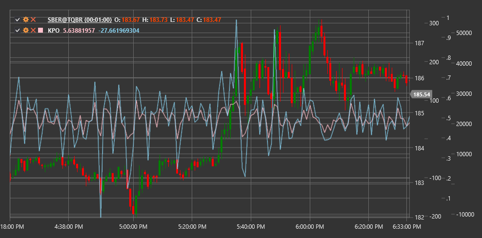

# KPO

**Kase-Peak-Oszillator (KPO)** ist ein von Celia Kase entwickelter technischer Indikator, der Dynamik und Volatilität kombiniert, um potenzielle Marktspitzen und -tiefs zu identifizieren.

Um den Indikator verwenden zu können, müssen Sie die Klasse [KasePeakOscillator](xref:StockSharp.Algo.Indicators.KasePeakOscillator) verwenden.

## Beschreibung

Der Kase-Peak-Oszillator (KPO) ist ein Tool zur Bestimmung überkaufter und überverkaufter Marktbedingungen und zur Identifizierung potenzieller Umkehrpunkte. Es wurde von der Händlerin und Ingenieurin Celia Kase als Teil ihrer Handelsmethodik entwickelt.

KPO basiert auf dem Konzept, dass sich Markthöhen und -tiefs bilden, wenn die Dynamik der Preisbewegung nachlässt. Der Oszillator verwendet eine Kombination aus Momentum- und Volatilitätsindikatoren, um diese wichtigen Wendepunkte zu identifizieren.

Der Indikator ist ein dimensionsloser Oszillator, der um die Nulllinie schwankt. Positive Werte weisen auf eine Aufwärtsdynamik hin, während negative Werte auf eine Abwärtsdynamik hinweisen. Extreme Oszillatorwerte fallen häufig mit Höchst- und Tiefstständen im Preisdiagramm zusammen.

## Parameter

Der Indikator hat die folgenden Parameter:
- **ShortPeriod** – kurzer Zeitraum für die Impulsberechnung (Standardwert: 10)
- **LongPeriod** – langer Zeitraum für die Impulsberechnung (Standardwert: 30)

## Berechnung

Die Kase-Peak-Oszillator-Berechnung umfasst mehrere Schritte:

1. Berechnen Sie das kurzfristige Momentum basierend auf dem kurzen Zeitraum:
   ```
   Short Momentum = EMA(Price, ShortPeriod) - EMA(Price, ShortPeriod)[previous]
   ```

2. Berechnen Sie das langfristige Momentum basierend auf dem langen Zeitraum:
   ```
   Long Momentum = EMA(Price, LongPeriod) - EMA(Price, LongPeriod)[previous]
   ```

3. Berechnen Sie die aktuelle Volatilität:
   ```
   Volatility = ATR(ShortPeriod)
   ```

4. Normalisieren Sie das Momentum im Verhältnis zur Volatilität:
   ```
   Normalized Short Momentum = Short Momentum / Volatility
   Normalized Long Momentum = Long Momentum / Volatility
   ```

5. Endgültige KPO-Berechnung:
   ```
   KPO = Normalized Short Momentum - Normalized Long Momentum
   ```

Dabei gilt:
- Price – normalerweise Schlusskurs
- EMA – exponentieller gleitender Durchschnitt
- ATR – durchschnittliche wahre Reichweite
- ShortPeriod - kurzer Berechnungszeitraum
- LongPeriod - langer Berechnungszeitraum

## Interpretation

Der Kase-Peak-Oszillator kann wie folgt interpretiert werden:

1. **Nulllinienübergänge**:
   - Ein Übergang von unten nach oben kann als bullisches Signal angesehen werden
   - Ein Übergang von oben nach unten kann als bärisches Signal angesehen werden

2. **Extreme Werte**:
   - Hohe positive Werte können auf überkaufte Marktbedingungen und eine mögliche Abwärtswende hinweisen
   - Hohe negative Werte können auf überverkaufte Marktbedingungen und eine mögliche Aufwärtstrendumkehr hinweisen

3. **Abweichungen**:
   - Eine bullische Divergenz (der Preis bildet ein neues Tief, während KPO ein höheres Tief bildet) könnte eine bevorstehende Aufwärtsumkehr signalisieren
   - Eine rückläufige Divergenz (der Preis bildet ein neues Hoch, während KPO ein niedrigeres Hoch bildet) könnte eine bevorstehende Abwärtsumkehr signalisieren

4. **Komponentenüberkreuzungen**:
   - Wenn das kurzfristige Momentum das langfristige Momentum von unten nach oben kreuzt, kann dies als bullisches Signal angesehen werden
   - Wenn das kurzfristige Momentum das langfristige Momentum von oben nach unten kreuzt, kann dies als bärisches Signal angesehen werden

5. **Beschleunigung und Verzögerung**:
   - Erhöhte KPO-Steigung zeigt Impulsbeschleunigung an
   - Eine verringerte KPO-Steigung weist auf eine Impulsverlangsamung hin, die einer Umkehr vorausgehen kann

6. **Kombination mit anderen Indikatoren**:
   - KPO wird häufig zusammen mit anderen technischen Indikatoren zur Bestätigung von Signalen verwendet
   - Besonders effektiv in Kombination mit Trendindikatoren und Unterstützungs-/Widerstandsniveaus



## Siehe auch

[MomentumOscillator](momentum.md)
[MACD](macd.md)
[PrettyGoodOscillator](pretty_good_oscillator.md)
[ATR](atr.md)
