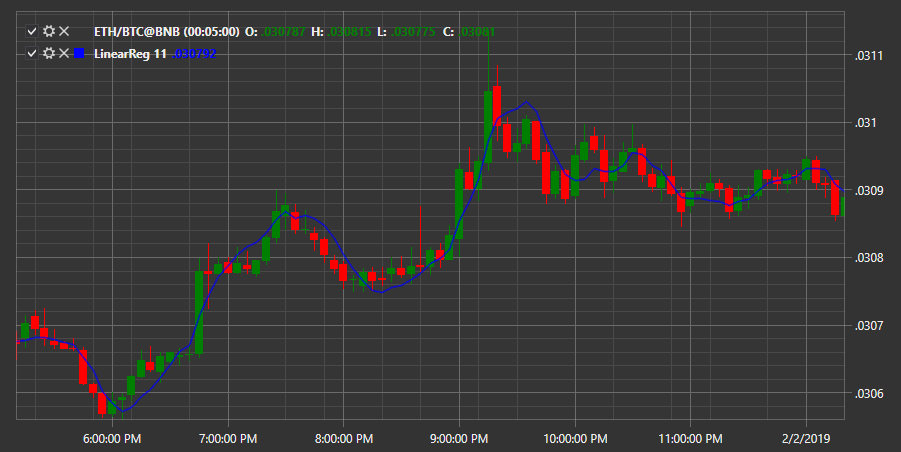

# LRC

**Linear Regression Curve (LRC)** ist eine Art gleitender Durchschnitt, der auf der linearen Regressionsgleichung basiert. Das Berechnungsergebnis ist eine Gerade mit der besten Anpassung für unterschiedliche Preise für den Zeitraum. Der Endpunkt dieser Linie wird zum Zeichnen des LRC verwendet.

Um den Indikator verwenden zu können, müssen Sie die Klasse [LinearReg](xref:StockSharp.Algo.Indicators.LinearReg) verwenden.

## Empfohlene Inhalte

[Logging](../../logging.md)
