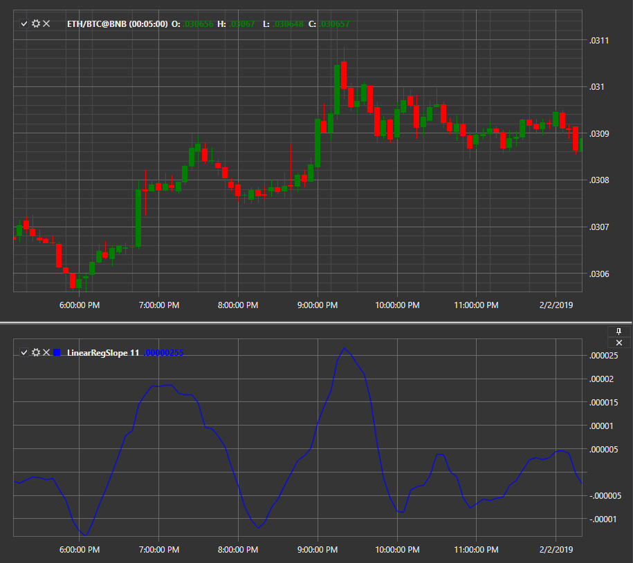

# Linear Regression Slope

Die Interpretation des **Linear Regression Slope**-Indikators zeigt den Steigungswert der Regressionslinien, die den aktuellen Preisbalken und den vorherigen n-1 Preisbalken umfassen (wobei n = Regressionsperioden).

Um den Indikator verwenden zu können, müssen Sie die Klasse [LinearRegSlope](xref:StockSharp.Algo.Indicators.LinearRegSlope) verwenden.

## Empfohlene Inhalte

[Protokollierung](../../logging.md)
