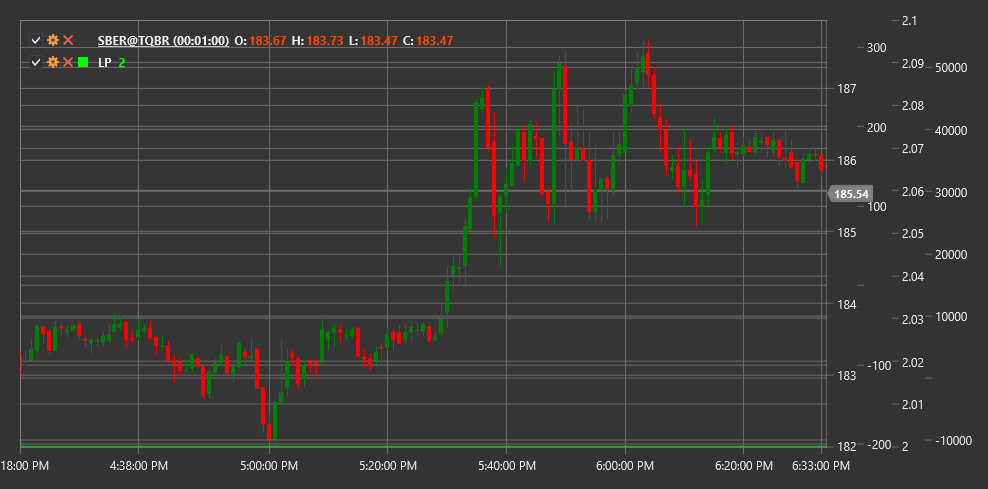

# LP

**Lunar Phase (LP)** ist ein unkonventioneller technischer Indikator, der auf astronomischen Daten über Mondphasen basiert, um den möglichen Einfluss von Mondzyklen auf die Finanzmärkte zu analysieren.

Um den Indikator verwenden zu können, müssen Sie die Klasse [LunarPhase](xref:StockSharp.Algo.Indicators.LunarPhase) verwenden.

## Beschreibung

Der Lunar Phase (LP)-Indikator ist ein ungewöhnliches technisches Analysetool, das Informationen über die aktuelle Mondphase nutzt, um potenzielle Markttrends vorherzusagen. Der Indikator basiert auf der Theorie, dass Mondzyklen das Verhalten der Marktteilnehmer und damit die Preisbewegungen von Finanzinstrumenten beeinflussen können.

Der Mondzyklus dauert etwa 29,53 Tage und ist traditionell in vier Hauptphasen unterteilt:
1. Neumond
2. Erstes Viertel (zunehmender Mond)
3. Vollmond
4. Letztes Viertel (Abnehmender Mond)

Der Indikator verfolgt die aktuelle Mondphase und stellt diese Informationen als numerischen Wert von 0 bis 1 dar, wobei:
- 0 entspricht dem Neumond
- 0,25 entspricht dem ersten Quartal
- 0,5 entspricht dem Vollmond
- 0,75 entspricht dem letzten Quartal

## Berechnung

Die Berechnung des Lunar Phase-Indikators basiert auf astronomischen Algorithmen zur Bestimmung der aktuellen Mondphase:

1. Bestimmen Sie die Anzahl der Tage, die seit Beginn des Mondzyklus (Neumond) vergangen sind:
   ```
   Current_Cycle_Position = (Current_Date - Last_New_Moon_Date) % 29.53
   ```

2. Wandeln Sie diesen Wert in eine Phase von 0 bis 1 um:
   ```
   Moon_Phase = Current_Cycle_Position / 29.53
   ```

Der resultierende Wert ist der Lunar Phase (LP)-Indikator.

## Interpretation

Die Interpretation des Lunar Phase-Indikators kann variieren, da es sich um ein unkonventionelles technisches Analysetool handelt. Es gibt jedoch einige allgemein akzeptierte Ansätze:

1. **Potenzielle Umkehrpunkte**:
   - Einige Händler glauben, dass Neu- und Vollmonde mit Marktumkehrpunkten zusammenfallen könnten
   - Übergänge zwischen Hauptphasen können auch als potenzielle Perioden erhöhter Volatilität angesehen werden

2. **Marktstimmungszyklen**:
   - Es gibt eine Theorie, dass Mondphasen die Massenpsychologie und damit die Marktstimmung beeinflussen können
   - Einige Studien deuten darauf hin, dass die Vollmondperiode zu emotionalerem und irrationalerem Händlerverhalten führen kann

3. **Volatilitätskorrelation**:
   - Einige Studien zeigen, dass die Volatilität während Vollmond- und Neumondperioden höher sein kann
   - Dies kann bei der Anpassung von Parametern anderer Indikatoren und Strategien verwendet werden

4. **Saisonale Muster**:
   - LP kann in Kombination mit einer saisonalen Musteranalyse verwendet werden, um potenzielle Marktperiodizitäten zu identifizieren

5. **Signalfilterung**:
   - Einige Händler verwenden LP als zusätzlichen Filter für ihre Handelsstrategien
   - Beispielsweise können sie bestimmte Arten von Geschäften während bestimmter Mondphasen vermeiden, wenn historische Statistiken eine geringe Effizienz zeigen

6. **Kombination mit anderen Indikatoren**:
   - LP wird normalerweise nicht als eigenständiges Tool für Handelsentscheidungen verwendet
   - Es wird empfohlen, es mit herkömmlichen technischen Indikatoren zu kombinieren, um Signale zu bestätigen

Beachten Sie, dass es keine ausreichenden wissenschaftlichen Beweise für den direkten Einfluss der Mondphase auf die Finanzmärkte gibt und viele professionelle Händler solchen Instrumenten skeptisch gegenüberstehen. Einige Marktteilnehmer finden es jedoch sinnvoll, LP in ihr Analysearsenal aufzunehmen.



## Siehe auch

[SineWave](sine_wave.md)
[HarmonicOscillator](harmonic_oscillator.md)
