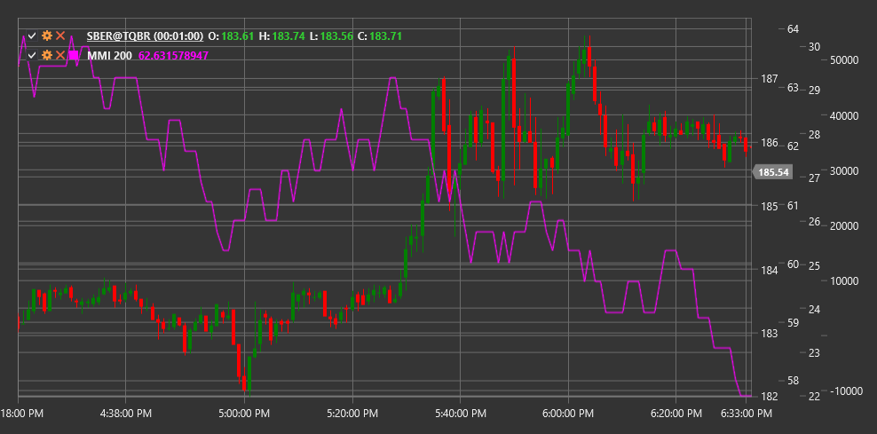

# MMI

**Market Meanness Index (MMI)** ist ein technischer Indikator, der entwickelt wurde, um festzustellen, ob sich der Markt in einem Trend- oder Seitwärtszustand (chaotisch) befindet.

Um den Indikator verwenden zu können, müssen Sie die Klasse [MarketMeannessIndex](xref:StockSharp.Algo.Indicators.MarketMeannessIndex) verwenden.

## Beschreibung

Der Market Meanness Index (MMI) ist ein Tool, das Händlern hilft, die Natur des aktuellen Marktes zu bestimmen – ob er tendenziell oder seitwärts verläuft. Der Name „Meanness“ spiegelt die Idee wider, dass sich der Markt manchmal „gemein“ oder unvorhersehbar gegenüber Händlern verhält, insbesondere wenn er sich in einer Seitwärtsbewegung befindet.

MMI basiert auf der Zählung der Anzahl der Preis-Wert-Paare (normalerweise Schlusskurse), die keinem einfachen linearen Muster folgen, und deren Verhältnis zur Gesamtzahl der analysierten Paare. Der Indikator misst das „Chaos“ oder die „Zufälligkeit“ der Preisbewegung über einen bestimmten Zeitraum.

Der Index schwankt von 0 bis 100:
- Low-Werte (normalerweise unter 50) weisen auf eine vorherrschende Trendbewegung hin
- Hohe Werte (normalerweise über 50) weisen auf eine überwiegende Seitwärtsbewegung oder chaotische Bewegung hin

## Parameter

Der Indikator hat die folgenden Parameter:
- **Length** – Berechnungszeitraum (Standardwert: 20)

## Berechnung

Die Market Meanness Index-Berechnung umfasst die folgenden Schritte:

1. Erstellen Sie einen Satz aufeinanderfolgender Schlusskurspaare (Close) innerhalb des angegebenen Length-Zeitraums.

2. Zählen Sie die Anzahl der „nicht sequentiellen“ Paare. Ein Paar gilt als nicht sequentiell, wenn es nicht dem für einen Trend typischen linearen Muster folgt. Wenn zwei aufeinanderfolgende Paare (P1, P2) und (P2, P3) entgegengesetzte Richtungen (unterschiedliche Differenzzeichen) haben, gilt das Paar als nicht sequentiell.

3. Berechnen Sie MMI als prozentuales Verhältnis:
   ```
   MMI = (Number of non-sequential pairs / Total number of pairs) * 100
   ```

Formal lässt sich dies wie folgt darstellen:
1. Überprüfen Sie für jedes Trio aufeinanderfolgender Preise (Close[i-2], Close[i-1], Close[i]):
   - Wenn (Close[i-1] - Close[i-2]) * (Close[i] - Close[i-1]) < 0, gilt das Paar als nicht sequentiell
   - Zählen Sie die Gesamtzahl solcher Paare

2. MMI = (Anzahl nicht aufeinanderfolgender Paare / (Length - 2)) * 100

## Interpretation

Der Market Meanness Index kann wie folgt interpretiert werden:

1. **Indikatorstufen**:
   - MMI > 50: Der Markt befindet sich in einem Seitwärts- oder Chaoszustand
   - MMI < 50: Der Markt befindet sich in einem Trendzustand
   - Je näher MMI an 100 liegt, desto chaotischer ist der Markt
   - Je näher MMI an 0 liegt, desto ausgeprägter ist der Trend

2. **Anwendung der Handelsstrategie**:
   - Wenn MMI hoch ist (>50), verwenden Sie Strategien, die auf einen Seitwärtsmarkt ausgerichtet sind (z. B. Range-Trading, Oszillatoren).
   - Wenn MMI niedrig ist (<50), verwenden Sie Trendstrategien (z. B. Trendfolge).

3. **Dynamik der Veränderungen**:
   - Ein Rückgang des MMI ausgehend von hohen Niveaus könnte die Bildung eines neuen Trends signalisieren
   - Ein Anstieg des MMI von niedrigen Niveaus aus könnte auf die Vervollständigung des Trends und den Übergang zur Konsolidierung hinweisen

4. **Extreme Werte**:
   - Sehr niedrige Werte (MMI < 20) können auf einen starken Trend, aber auch auf mögliche überkaufte/überverkaufte Bedingungen hinweisen
   - Sehr hohe Werte (MMI > 80) weisen auf einen äußerst chaotischen Markt hin, in dem es schwierig ist, Strategien anzuwenden

5. **Signalfilterung**:
   - MMI wird oft als Filter für andere Indikatoren verwendet:
     - Trendindikatorsignale (MA, MACD) sind bei niedrigem MMI zuverlässiger
     - Oszillatorsignale (RSI, Stochastic) sind bei hohem MMI zuverlässiger

6. **Kombination mit anderen Indikatoren**:
   - MMI funktioniert gut in Kombination mit ADX (Average Directional Index)
   - Low MMI und der hohe ADX bestätigen einen starken Trend
   - High MMI und niedriges ADX bestätigen einen Seitwärtsmarkt

7. **Zeitrahmen**:
   - MMI kann in verschiedenen Zeitrahmen verwendet werden, um den Marktcharakter zu bestimmen
   - Langfristiges MMI hilft bei der Bestimmung des Primärzustands des Marktes
   - Kurzfristiges MMI hilft bei der Auswahl einer geeigneten Strategie für die aktuellen Bedingungen



## Siehe auch

[ChoppinessIndex](choppiness_index.md)
[ADX](adx.md)
[VHF](vhf.md)
[BalanceOfPower](balance_of_power.md)
