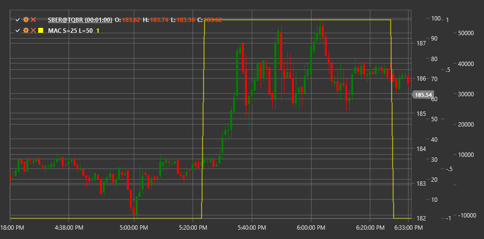

# MAC

**Kreuzung gleitender Durchschnitte (MAC)** ist ein technischer Indikator, der Überschneidungen zwischen kurzen und langen gleitenden Durchschnitten verfolgt, um potenzielle Markteintritts- und -austrittspunkte zu identifizieren.

Um den Indikator verwenden zu können, müssen Sie die Klasse [MovingAverageCrossover](xref:StockSharp.Algo.Indicators.MovingAverageCrossover) verwenden.

## Beschreibung

Der Indikator zur Kreuzung gleitender Durchschnitte (MAC) ist einer der am häufigsten verwendeten und am einfachsten zu verstehenden Indikatoren in der technischen Analyse. Er basiert auf dem Konzept, dass, wenn ein kurzfristiger gleitender Durchschnitt einen langfristigen gleitenden Durchschnitt kreuzt, dies eine Trendänderung oder eine erhebliche Preisbewegung signalisieren kann.

MAC verwendet zwei gleitende Durchschnitte mit unterschiedlichen Perioden:
1. Kurzer gleitender Durchschnitt (FastMA) – spiegelt die jüngste Preisbewegung wider
2. Langer gleitender Durchschnitt (SlowMA) – spiegelt längerfristige Preisbewegungen wider

Der Indikator wird typischerweise als Differenz zwischen den kurzen und langen gleitenden Durchschnitten dargestellt, was eine einfache Identifizierung des Übergangszeitpunkts (wenn der Indikatorwert die Nulllinie kreuzt) ermöglicht.

MAC wird häufig sowohl in eigenständigen Handelsstrategien als auch als Teil komplexerer Systeme wie MACD (Konvergenz/Divergenz gleitender Durchschnitte) verwendet.

## Parameter

Der Indikator hat die folgenden Parameter:
- **Kurzer Zeitraum** – Zeitraum für den kurzen gleitenden Durchschnitt (Standardwert: 9)
- **Langer Zeitraum** – Zeitraum für den langen gleitenden Durchschnitt (Standardwert: 26)

## Berechnung

Die Berechnung des Indikators zur Kreuzung gleitender Durchschnitte umfasst die folgenden Schritte:

1. Berechnen Sie den kurzen gleitenden Durchschnitt:
   ```
   FastMA = SMA(Price, ShortPeriod)
   ```

2. Berechnen Sie den langen gleitenden Durchschnitt:
   ```
   SlowMA = SMA(Price, LongPeriod)
   ```

3. Berechnen Sie den MAC-Wert als Differenz zwischen kurzen und langen gleitenden Durchschnitten:
   ```
   MAC = FastMA - SlowMA
   ```

Dabei gilt:
- Price - Preis (normalerweise Schlusskurs)
- SMA – einfacher gleitender Durchschnitt
- ShortPeriod – Zeitraum für den kurzen gleitenden Durchschnitt
- LongPeriod – Zeitraum für den langen gleitenden Durchschnitt

Hinweis: Anstelle von SMA können auch andere Arten von gleitenden Durchschnitten wie EMA (exponentieller gleitender Durchschnitt), WMA (gewichteter gleitender Durchschnitt) usw. verwendet werden.

## Interpretation

Der Indikator zur Kreuzung gleitender Durchschnitte kann wie folgt interpretiert werden:

1. **Nulllinienübergänge**:
   - Das Überqueren der MAC-Nulllinie von unten nach oben (FastMA kreuzt SlowMA von unten nach oben) erzeugt ein zinsbullisches Signal, das auf einen möglichen Beginn eines Aufwärtstrends hinweist
   - Das Überqueren der MAC-Nulllinie von oben nach unten (FastMA kreuzt SlowMA von oben nach unten) erzeugt ein rückläufiges Signal, das auf einen möglichen Beginn eines Abwärtstrends hinweist

2. **Indikatorwert**:
   - Ein positiver MAC-Wert zeigt an, dass der kurze gleitende Durchschnitt über dem langen gleitenden Durchschnitt liegt, was oft als bullischer Marktzustand interpretiert wird
   - Ein negativer MAC-Wert zeigt an, dass der kurze gleitende Durchschnitt unter dem langen gleitenden Durchschnitt liegt, was oft als rückläufiger Marktzustand interpretiert wird

3. **Abstand zwischen gleitenden Durchschnitten**:
   - Ein zunehmender Abstand zwischen den gleitenden Durchschnitten (zunehmender absoluter MAC-Wert) weist auf eine Trendverstärkung hin
   - Ein abnehmender Abstand zwischen gleitenden Durchschnitten (abnehmender absoluter MAC-Wert) kann auf eine Abschwächung des Trends und eine mögliche Umkehr hinweisen

4. **Falsche Signale**:
   - Während Seitwärtskonsolidierungsperioden kann MAC aufgrund häufiger Überkreuzungen des gleitenden Durchschnitts mehrere falsche Signale erzeugen
   - Zusätzliche Indikatoren oder Regeln werden häufig verwendet, um falsche Signale zu filtern (z. B. die Anforderung, dass der Preis über/unter beiden gleitenden Durchschnitten liegen muss)

5. **Kombination mit anderen Indikatoren**:
   - MAC wird häufig in Kombination mit Momentumindikatoren (RSI, Stochastik) zur Bestätigung von Signalen verwendet
   - Es kann auch mit Trend- und Volatilitätsindikatoren kombiniert werden, um umfassendere Handelssysteme zu schaffen

6. **Parameterauswahl**:
   - Kürzere Zeiträume (z. B. 5 und 20) sind sensibler und für den kurzfristigen Handel geeignet
   - Längere Zeiträume (z. B. 50 und 200) sind weniger empfindlich und für den langfristigen Handel geeignet



## Siehe auch

[SMA](sma.md)
[EMA](ema.md)
[MACD](macd.md)
[MovingAverageRibbon](moving_average_ribbon.md)
