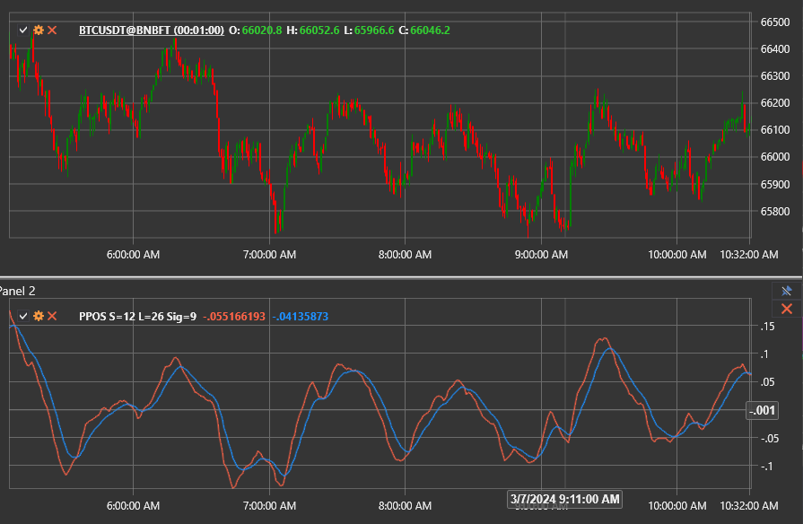

# PPO-Signal

Der **PPO-Signalindikator (PPOS)** erweitert den Standard-PPO um die zugehörige Signallinie, die normalerweise zum Filtern von Trades verwendet wird.

Um den Indikator zu verwenden, verwenden Sie die Klasse [PercentagePriceOscillatorSignal](xref:StockSharp.Algo.Indicators.PercentagePriceOscillatorSignal).

## Beschreibung

Der prozentuale Preisoszillator (PPO) misst die prozentuale Differenz zwischen zwei exponentiellen gleitenden Durchschnitten (EMAs). Die Signalversion konzentriert sich auf die Glättung der PPO-Linie mit einem zusätzlichen EMA und hilft Händlern, nur auf anhaltendere Impulsverschiebungen zu reagieren.

Der Indikator besteht aus folgenden Komponenten:

1. **PPO-Linie** – der prozentuale Unterschied zwischen dem schnellen und dem langsamen EMAs.
2. **Signallinie** – ein EMA, berechnet aus der PPO-Linie (standardmäßig 9 Perioden).

Wenn die PPO-Linie die Signallinie überschreitet, deutet dies auf eine zunehmende Aufwärtsdynamik hin; Ein Übergang nach unten signalisiert eine Stärkung der rückläufigen Dynamik. Ein Verbleib über oder unter der Signallinie kann die Stärke des vorherrschenden Trends bestätigen.

## Berechnung

1. Berechnen Sie den schnellen und langsamen EMAs der ausgewählten Preisreihe.
2. Berechnen Sie die PPO-Linie als prozentualen Abstand zwischen dem schnellen und dem langsamen EMAs.
3. Glätten Sie die PPO-Leitung mit einem EMA, um die Signalleitung zu erhalten.

```
FastEMA = EMA(Price, ShortPeriod)
SlowEMA = EMA(Price, LongPeriod)
PPO = ((FastEMA - SlowEMA) / SlowEMA) * 100
Signal = EMA(PPO, SignalPeriod)
```

## Interpretation

- **Signalkreuzungen.** Ein bullisches Signal tritt auf, wenn die PPO-Linie die Signallinie von unten kreuzt; Der entgegengesetzte Crossover deutet auf eine rückläufige Dynamik hin.
- **Trendbestätigung.** Das Halten über der Signallinie bestätigt einen Aufwärtstrend, während das Bleiben unter der Signallinie einen Abwärtstrend unterstützt.
- **Divergenzen.** Divergenzen zwischen der Preisbewegung und der PPO-Linie während der Interaktion mit der Signallinie können Umkehrungen vorwegnehmen.



## Siehe auch

- [PPO](percentage_price_oscillator.md)
- [PPO-Histogramm](percentage_price_oscillator_histogram.md)
