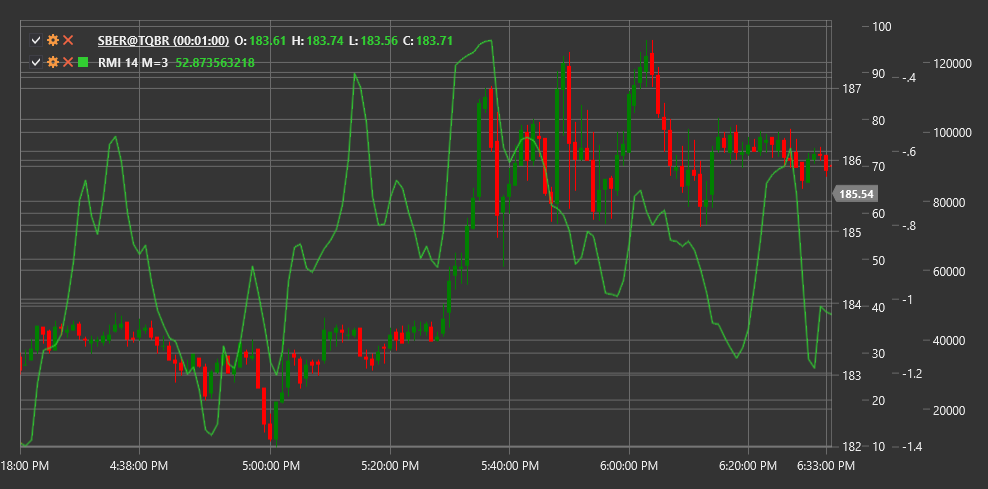

# RMI

**Relativer Momentumindex (RMI)** ist eine Modifikation des traditionellen RSI-Indikators, vorgeschlagen von Roger Altman. Im Gegensatz zum klassischen RSI, der das Verhältnis von Preissteigerungen und -rückgängen über einen bestimmten Zeitraum berechnet, berücksichtigt RMI die relative Preisänderung über einen ausgewählten Momentum-Zeitraum.

Um den Indikator verwenden zu können, müssen Sie die Klasse [RelativeMomentumIndex](xref:StockSharp.Algo.Indicators.RelativeMomentumIndex) verwenden.

## Beschreibung

Der Relativer Momentumindex (RMI) verbessert den klassischen RSI durch Hinzufügen eines Impulsperiodenparameters. Dadurch können Händler die Empfindlichkeit des Indikators anpassen, ohne den Hauptberechnungszeitraum zu ändern.

Wie RSI schwankt RMI zwischen 0 und 100:
- Werte über 70 deuten normalerweise auf einen überkauften Markt hin
- Werte unter 30 deuten auf einen überverkauften Markt hin
- Die Mittellinie bei 50 dient als Referenzpunkt zur Bestimmung der Hauptbewegungsrichtung des Marktes

RMI ist besonders nützlich, um potenzielle Trendumkehrpunkte zu identifizieren und die Stärke des aktuellen Trends zu bestätigen.

## Parameter

- **Momentum-Zeitraum** – Momentum-Periode, die die Zeitverzögerung für den Preisvergleich definiert.
- **Länge** – Hauptperiode zur Berechnung des Indikators (ähnlich der Periode in RSI).

## Berechnung

Die RMI-Berechnung erfolgt in mehreren Schritten:

1. Berechnen Sie das Momentum als Differenz zwischen dem aktuellen Preis und dem Preis vor n Perioden:
   ```
   Momentum = Price(current) - Price(current - MomentumPeriod)
   ```

2. Teilen Sie Impulse in positive (U) und negative (D) auf:
   ```
   Wenn Momentum > 0, dann U = Momentum, D = 0
   Wenn Momentum < 0, dann U = 0, D = |Momentum|
   ```

3. Berechnen Sie die Durchschnittswerte der positiven und negativen Impulse über den angegebenen Zeitraum:
   ```
   AverageU = SMA(U, Length)
   AverageD = SMA(D, Length)
   ```

4. Berechnen Sie die relative Stärke:
   ```
   RS = AverageU / AverageD
   ```

5. In Relativer Momentumindex konvertieren:
   ```
   RMI = 100 - (100 / (1 + RS))
   ```



## Siehe auch

[RSI](rsi.md)
[Impuls](momentum.md)
