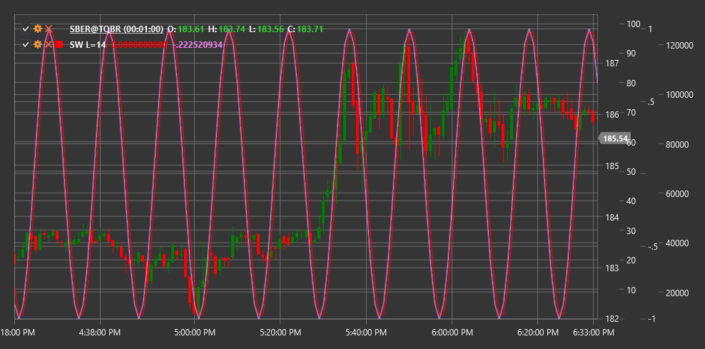

# SW

**Sinuswelle (SW)** ist ein technischer Indikator, der die mathematische Sinusfunktion verwendet, um zyklische Muster in der Preisbewegung zu identifizieren. Der Indikator zielt darauf ab, periodische Marktschwankungen zu erkennen und vorherzusagen.

Um den Indikator verwenden zu können, müssen Sie die Klasse [SineWave](xref:StockSharp.Algo.Indicators.SineWave) verwenden.

## Beschreibung

Der Sinuswelle-Indikator basiert auf der Idee, dass Marktbewegungen zyklischer Natur sind und mithilfe von Sinusfunktionen modelliert werden können. Dieser Indikator ist besonders nützlich in Märkten, die sich seitwärts bewegen oder vorhersehbare zyklische Schwankungen aufweisen.

Hauptmerkmale des Indikators:
- Hilft bei der Identifizierung potenzieller Marktumkehrpunkte
- Ermöglicht die Bestimmung der aktuellen Position im Zyklus
- Kann verwendet werden, um zukünftige Preisbewegungen vorherzusagen

Anzeigesignale:
- Möglicher Kauf, wenn die Sinuswellenlinie ein Minimum erreicht und beginnt, nach oben zu drehen
- Möglicher Verkauf, wenn die Linie ein Maximum erreicht und beginnt, nach unten zu fallen

## Parameter

- **Länge** – Periode des Sinuswellenzyklus, die die Zykluslänge in Preisbalken definiert.

## Berechnung

Die Berechnung des Sinuswelle-Indikators basiert auf der Verwendung der Sinusfunktion und der Bestimmung des dominanten Zyklus in der Preisbewegung:

1. Bestimmung des dominanten Zyklus mittels Spektralanalyse oder einer anderen Methode zur Zyklusidentifikation.

2. Anwendung der Sinusfunktion zur Modellierung des identifizierten Zyklus:
   ```
   SineWave(t) = A * sin(2π * t / Length + φ)
   ```
   Dabei gilt:
   - A - Amplitude (Wellenhöhe)
   - t - aktuelle Zeit oder Balken
   - Length - Zykluslänge
   - φ – Phasenverschiebung, um die Sinuswelle an den tatsächlichen Preiszyklus anzupassen

3. Zusätzlich kann ein Vorlaufindikator berechnet werden, der die Hauptsinuswelle um einen Viertelzyklus voreilt:
   ```
   Lead(t) = A * sin(2π * t / Length + φ + π/2)
   ```

Der Indikator kann zusätzliche Komponenten wie eine Trendlinie oder einen Filter enthalten, um die Signalgenauigkeit zu verbessern.



## Siehe auch

[Schaff-Trendzyklus](schaff_trend_cycle.md)
