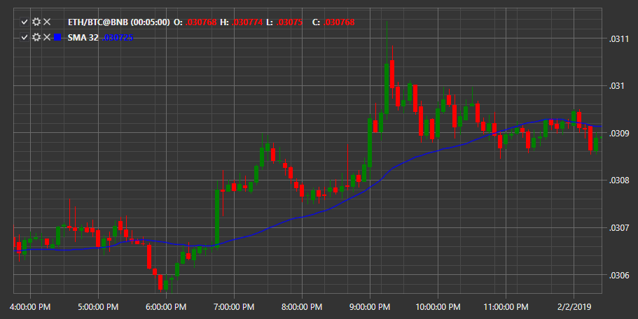

# SMA

**Einfacher gleitender Durchschnitt (SMA)** ist ein arithmetischer gleitender Durchschnitt, der durch Addition der letzten Schlusskurse und Division dieser Zahl durch die Anzahl der Zeiträume berechnet wird.

Um den Indikator verwenden zu können, müssen Sie die Klasse [SimpleMovingAverage](xref:StockSharp.Algo.Indicators.SimpleMovingAverage) verwenden.

## Empfohlene Inhalte

[geglätteter gleitender Durchschnitt](smoothed_ma.md)
