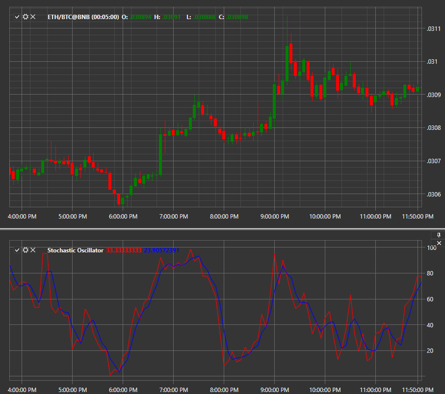

# Stochastischer Oszillator

**Stochastischer Oszillator** ist ein Momentum-Indikator, der einen bestimmten Schlusskurs eines Wertpapiers mit einer Preisspanne für einen bestimmten Zeitraum vergleicht. Die Empfindlichkeit des Oszillators gegenüber Marktbewegungen kann verringert werden, indem dieser Zeitraum angepasst oder der gleitende Durchschnitt aus dem Ergebnis ermittelt wird.

Um den Indikator verwenden zu können, müssen Sie die Klasse [StochasticOscillator](xref:StockSharp.Algo.Indicators.StochasticOscillator) verwenden.

## Empfohlene Inhalte

[Sum N](sum_n.md)
