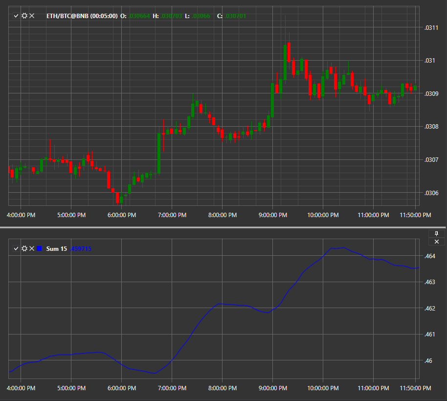

# Summe N

Der Indikator **Summe N** zeigt die Summe der letzten N Werte für den Zeitraum an.

Um den Indikator verwenden zu können, müssen Sie die Klasse [Sum](xref:StockSharp.Algo.Indicators.Sum) verwenden.

## Empfohlene Inhalte

[TEMA](tema.md)
