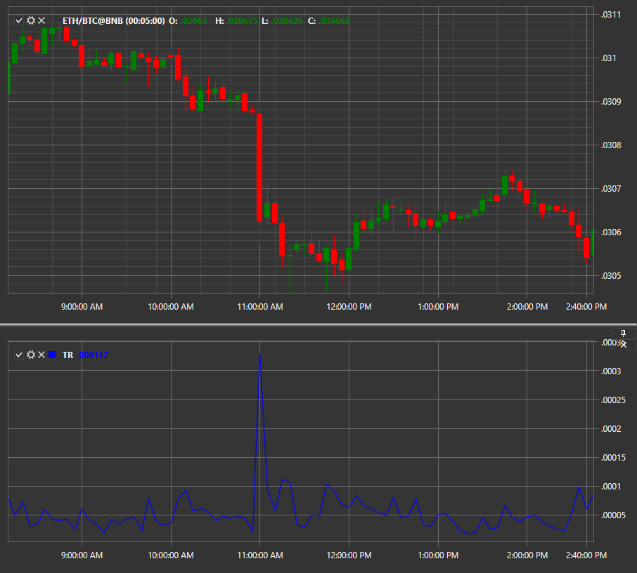

# Wahre Spanne

**Wahre Spanne (TR)** zeigt die aktuelle Marktvolatilität, indem sie die Schwankungsbreite von Höchst-, Tiefst- und Schlusskursen bestimmt.

Um den Indikator zu verwenden, nutzen Sie die Klasse [TrueRange](xref:StockSharp.Algo.Indicators.TrueRange).

## Empfohlene Inhalte

[UO](uo.md)
