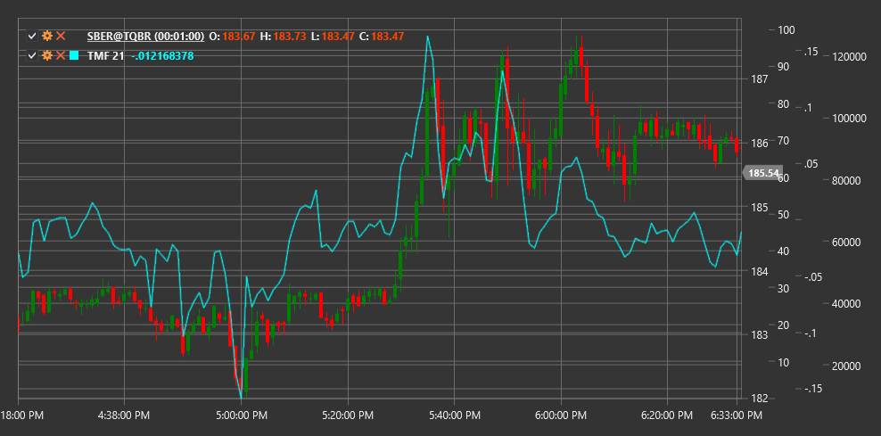

# TMF

**Twiggs Money Flow (TMF)** ist ein von Colin Twiggs entwickelter Volumenindikator und eine verbesserte Version des Chaikin Money Flow. TMF reagiert empfindlicher auf Änderungen der Marktstimmung und erzeugt weniger Fehlsignale.

Um den Indikator zu verwenden, nutzen Sie die Klasse [TwiggsMoneyFlow](xref:StockSharp.Algo.Indicators.TwiggsMoneyFlow).

## Beschreibung

Twiggs Money Flow analysiert das Verhältnis zwischen Preis und Volumen, um die Richtung des Geldflusses in den Markt hinein oder aus dem Markt heraus zu bestimmen. Im Unterschied zu traditionellen Volumenindikatoren reduziert TMF Rauschen, indem die Werte zwischen -1 und +1 normalisiert werden.

Wichtige Eigenschaften von TMF:
- Positive Werte zeigen Geldzufluss in das Instrument an (bullische Stimmung)
- Negative Werte zeigen Geldabfluss aus dem Instrument an (bärische Stimmung)
- Ein Wert von 0 zeigt ein Gleichgewicht zwischen Angebot und Nachfrage

Der Indikator ist nützlich für:
- Bestätigung des aktuellen Trends oder Erkennung von Trendschwäche
- Erkennung von Divergenzen zwischen Preis und Geldfluss
- Identifikation möglicher Marktwendepunkte

## Parameter

- **Length** - Berechnungsperiode für den exponentiellen gleitenden Durchschnitt, typischerweise mit dem Wert 21.

## Berechnung

Twiggs Money Flow wird in mehreren Schritten berechnet:

1. True Range berechnen:
   ```
   TR = Max(High - Low, |High - Previous Close|, |Low - Previous Close|)
   ```

2. Twiggs Money Flow Volume (TMFV) bestimmen:
   ```
   TMFV = Volume * ((Close - Low - (High - Close)) / TR)
   ```
   Wenn (High - Low = 0), gilt TMFV = 0

3. Exponentiellen gleitenden Durchschnitt von TMFV und Volumen berechnen:
   ```
   EMA_TMFV = EMA(TMFV, Length)
   EMA_Volume = EMA(Volume, Length)
   ```

4. Endgültiger TMF-Wert:
   ```
   TMF = EMA_TMFV / EMA_Volume
   ```

TMF-Werte reichen von -1 (starkes bärisches Signal) bis +1 (starkes bullisches Signal).



## Siehe auch

[ADL](accumulation_distribution_line.md)
[Money Flow Index](money_flow_index.md)
[OBV](on_balance_volume.md)

