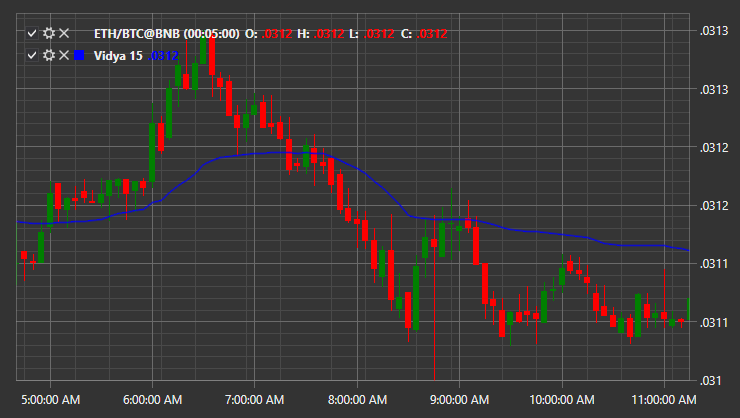

# VIDYA

**dynamischer Durchschnitt mit variablem Index (VIDYA)** ist ein Indikator mit einer eigenen Methode zur Berechnung des exponentiellen gleitenden Durchschnitts (EMA) mit dynamisch veränderlicher Durchschnittsperiode. Die Durchschnittsperiode hängt von der Marktvolatilität ab; als Volatilitätsmaß wird ein Momentum-Oszillator (CMO) verwendet.

Um den Indikator zu verwenden, nutzen Sie die Klasse [Vidya](xref:StockSharp.Algo.Indicators.Vidya).

## Empfohlene Inhalte

[JMA](jma.md)

