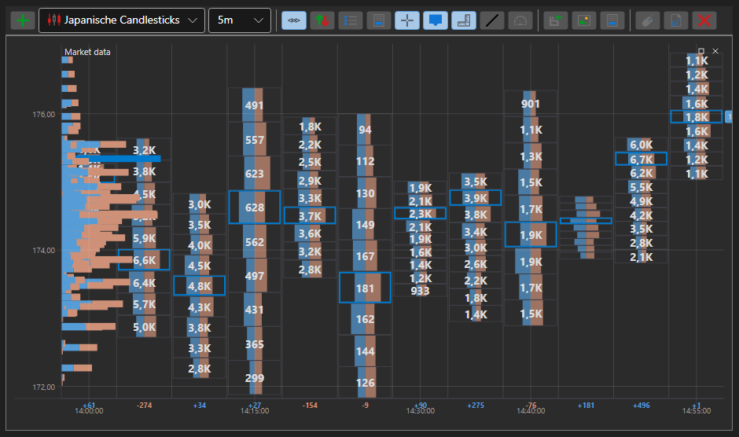

# Volumenprofil

**Volumenprofil** ist ein erweiterter Indikator, der die Handelsaktivität für einen bestimmten Zeitraum und auf bestimmten Preisniveaus darstellt. Der Indikator ist ein Histogramm im Chart, das auf Basis des Volumens vorherrschende oder wichtige Preisniveaus zeigt.

Um den Indikator zu verwenden, nutzen Sie die Klasse [VolumeProfileIndicator](xref:StockSharp.Algo.Indicators.VolumeProfileIndicator).

## Empfohlene Inhalte

[Volumengewichteter gleitender Durchschnitt](volume_weighted_ma.md)
