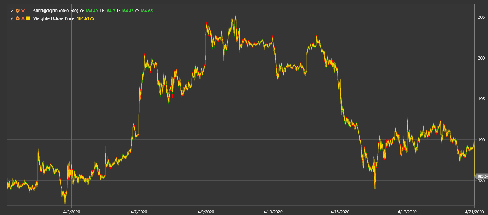

# Gewichteter Schlusskurs

**Gewichteter Schlusskurs (WCP)** wird für jede Kerze als (High + Low + 2 * Close) / 4 berechnet.

Um den Indikator zu verwenden, nutzen Sie die Klasse [WeightedClosePrice](xref:StockSharp.Algo.Indicators.WeightedClosePrice).

## Empfohlene Inhalte

[Typischer Preis](typical_price.md)
