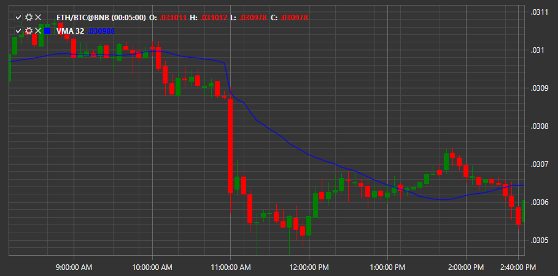

# Weighted MA

**Weighted Moving Average (WMA)** - der Indikator zeigt den gewichteten Durchschnittspreis für einen bestimmten Zeitraum. Er folgt dem Preis als wellenförmige Linie und weist eine gewisse Abweichung gegenüber dem Preis-Chart auf.

Um den Indikator zu verwenden, nutzen Sie die Klasse [WeightedMovingAverage](xref:StockSharp.Algo.Indicators.WeightedMovingAverage).

## Empfohlene Inhalte

[%R](williams_r.md)

